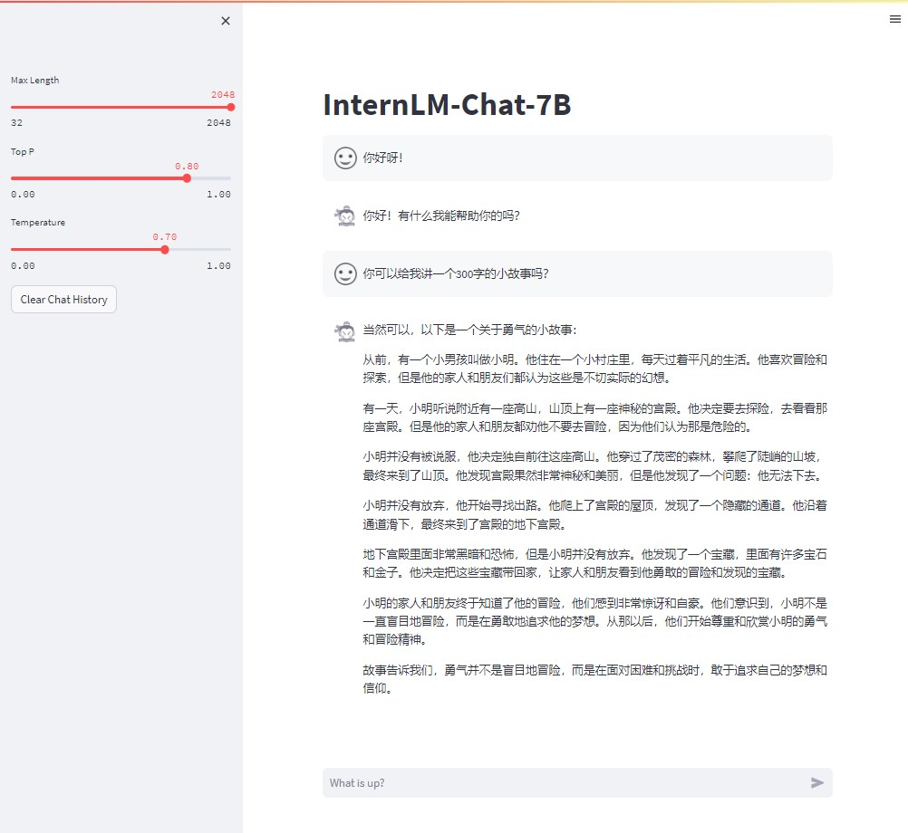
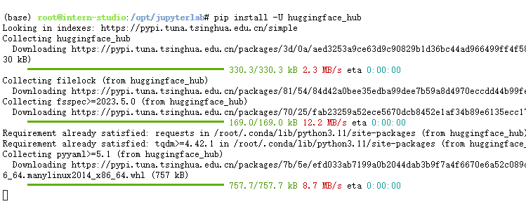
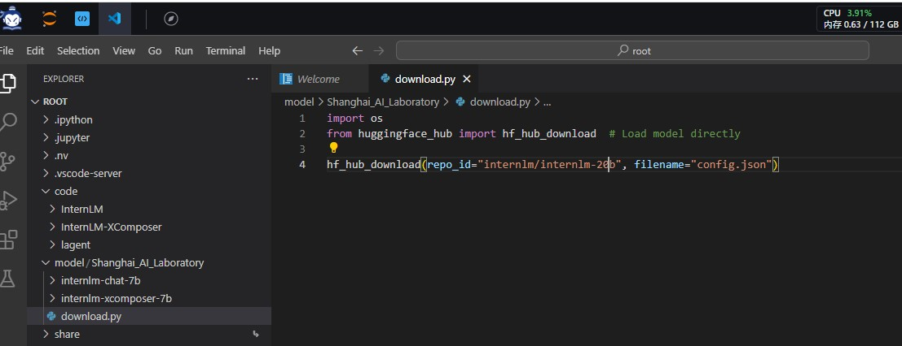
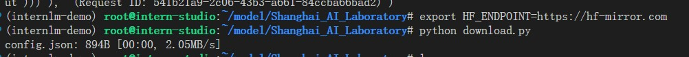
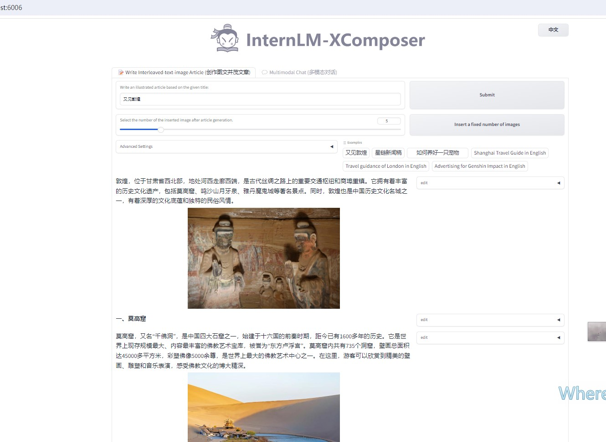
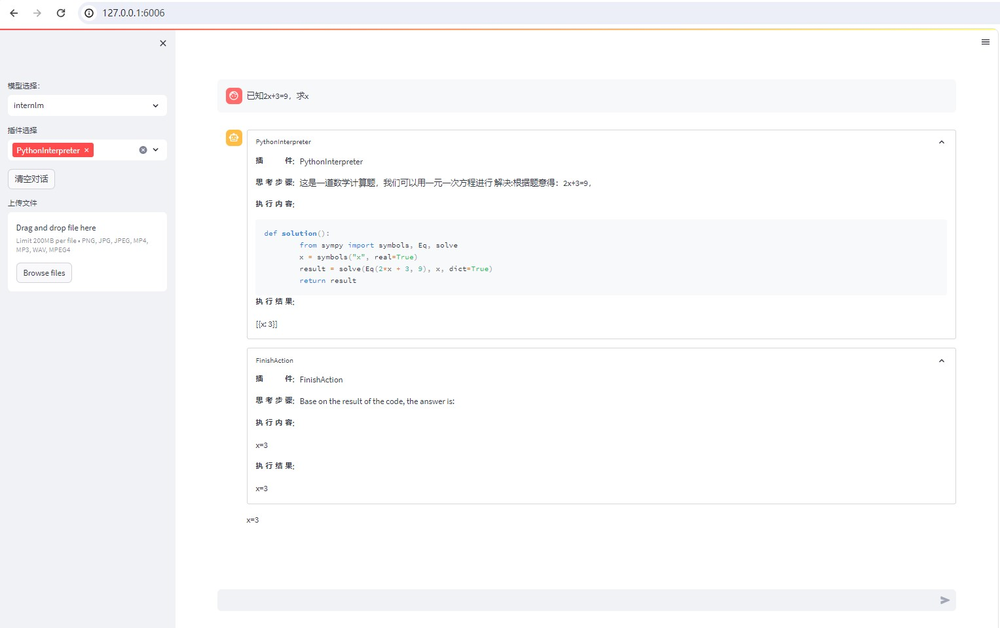

# 【Lectrue-2】课后作业

## 基础作业

### 1.作业一
* 使用InternLM-Chat-7B模型生成300字的小故事。



### 2.作业二
* 熟悉Hugging Face下载功能，使用`huggingface_hub`python包，下载InternLM-20B的config.json文件到本地。

#### (1)安装huggingface工具
```sh
pip install -U huggingface_hub
```


#### (2)书写代码



### (3)运行下载代码


## 进阶作业

### 1.作业一

* 完成浦语·灵笔的图文理解及创作部署



### 2.作业二

* 完成Lagent工具调用Demo创作部署


