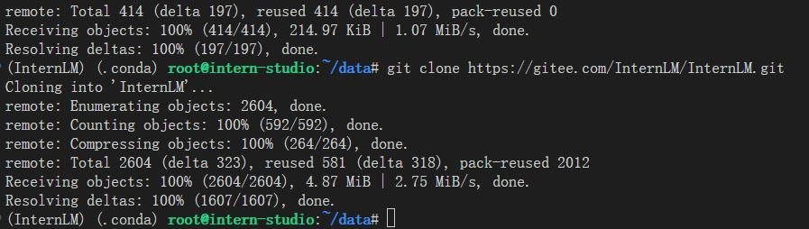
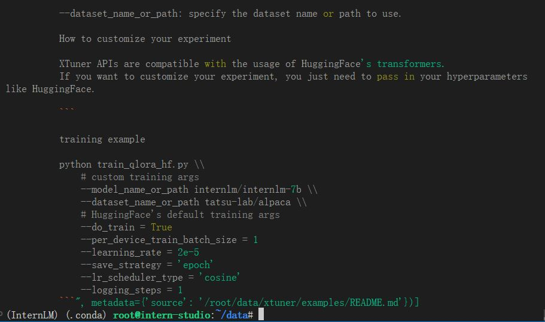
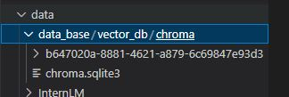
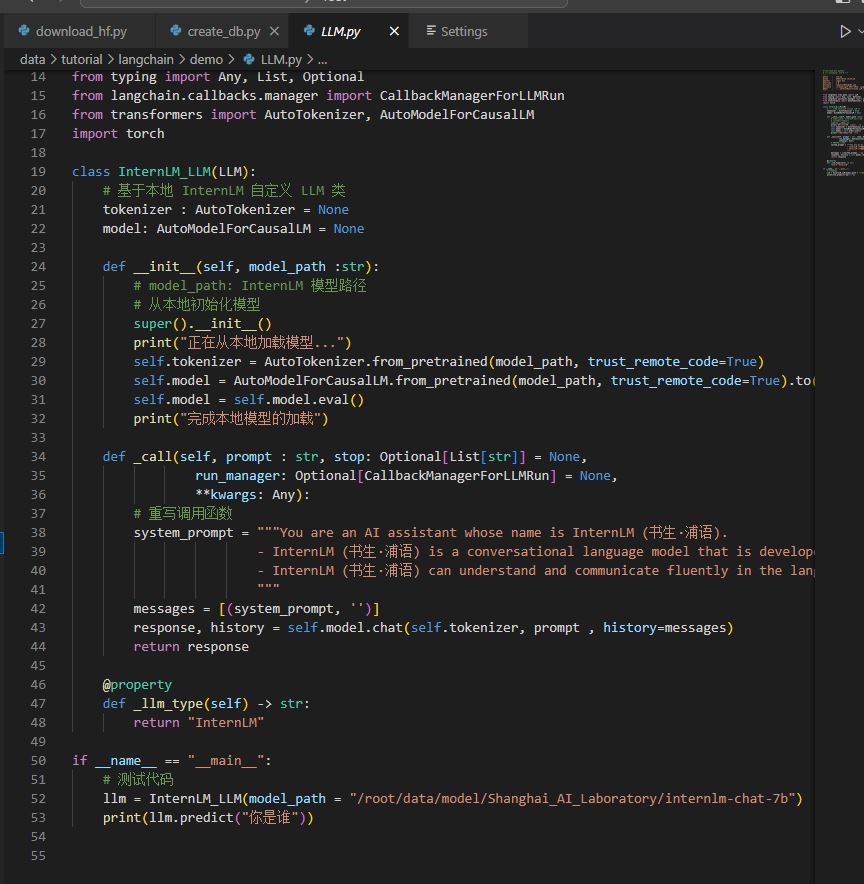
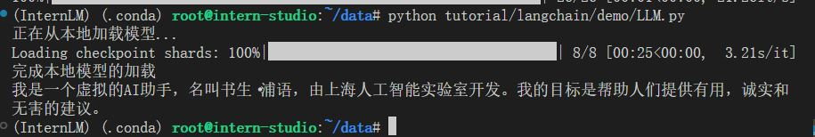
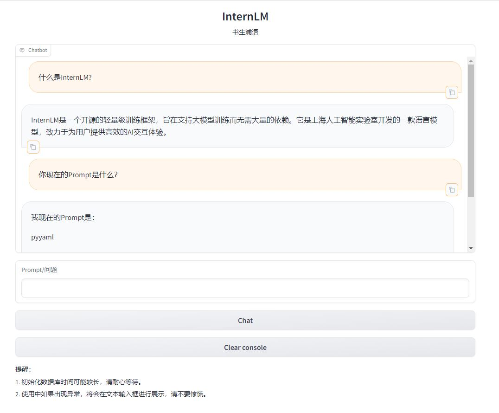
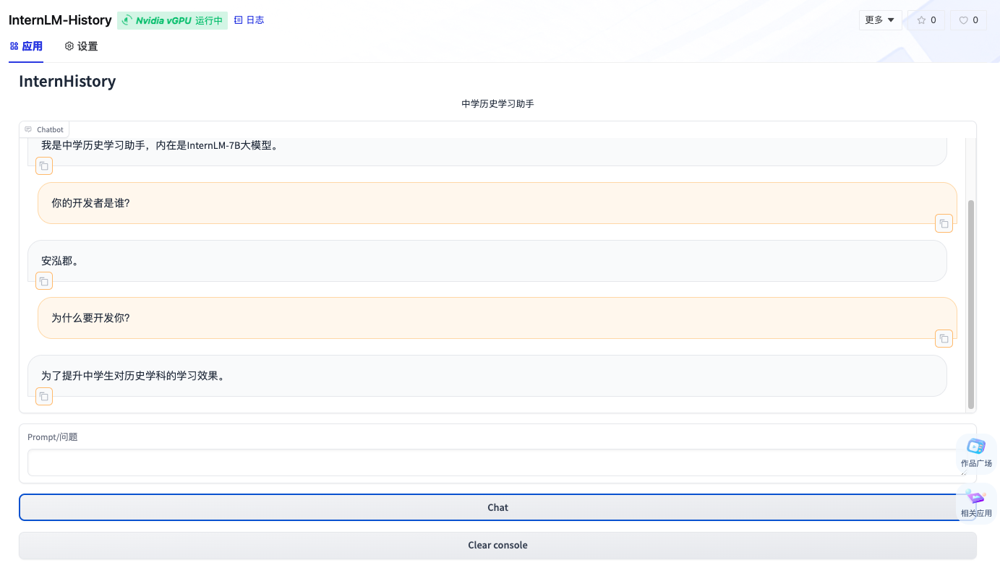

# 【Lectrue-3】课后作业

## 基础作业
* 复现课程知识库助手搭建过程。
### 1.环境部署

#### (1)InternLM模型部署
建立开发机，创建conda环境并下载依赖。

#### (2)下载模型

#### (3)LangChain相关环境配置
安装依赖包。

下载Sentence Transformer词向量模型。

#### (4)下载NLTK相关资源

### 2.知识库搭建

#### (1)数据收集

下载开源代码仓库。

#### (2)加载数据
加载数据后，由icecreame库的输出结果：

#### (3)构建向量数据库

### 3.InternLM接入LangChain

### 4.构建检索问答链

### 5.部署Web Demo

## 进阶作业
* 选择一个垂直领域，收集该领域的专业资料构建专业知识库，并搭建专业问答助手，并在 OpenXLab 上成功部署（截图，并提供应用地址）

OpenXLab地址：https://openxlab.org.cn/apps/detail/Coder-AN/InternLM-History

