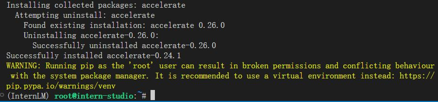
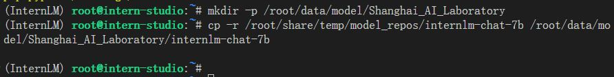
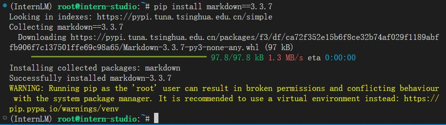
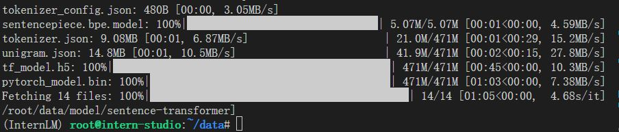
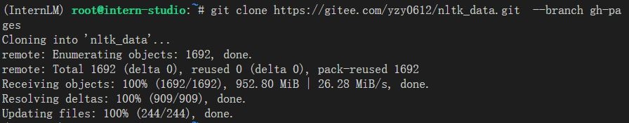

# 【Lectrue-3】课后作业

## 基础作业
* 复现课程知识库助手搭建过程。
### 1.环境部署

#### (1)InternLM模型部署
建立开发机，创建conda环境并下载依赖。

#### (2)下载模型

#### (3)LangChain相关环境配置
安装依赖包。

下载Sentence Transformer词向量模型。

#### (4)下载NLTK相关资源

## 进阶作业
### 1.作业一
* 选择一个垂直领域，收集该领域的专业资料构建专业知识库，并搭建专业问答助手，并在 OpenXLab 上成功部署（截图，并提供应用地址）