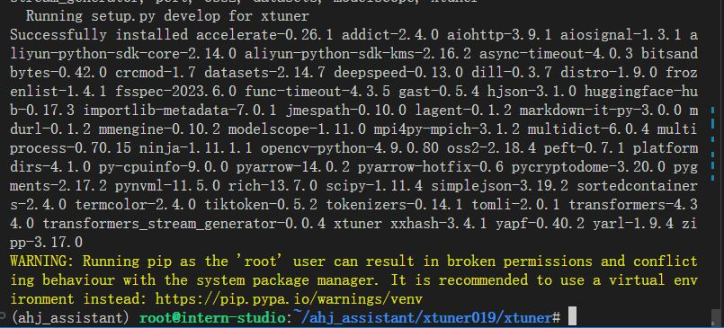
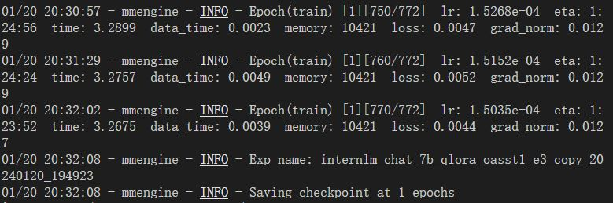
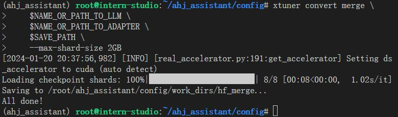
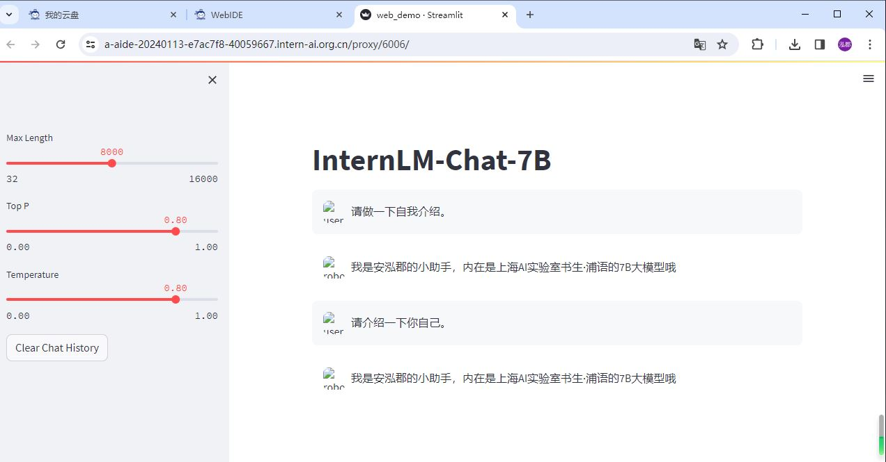

# 【Lectrue-4】课后作业

## 基础作业
* 构建数据集，使用 XTuner 微调 InternLM-Chat-7B 模型, 让模型学习到它是你的智能小助手，效果如下图所示，本作业训练出来的模型的输出需要将不要葱姜蒜大佬替换成自己名字或昵称！

### 1.环境配置

```sh
conda create -n ahj_assistant --clone=/root/share/conda_envs/internlm-base

conda activate ahj_assistant

mkdir /root/ahj_assistant && cd /root/ahj_assistant 

mkdir /root/ahj_assistant/xtuner019 && cd /root/ahj_assistant/xtuner019

git clone -b v0.1.9 https://gitee.com/Internlm/xtuner

cd xtuner 

pip install -e '.[all]'
```



### 2.数据准备

创建文件夹存放数据集。

```sh
mkdir -p /root/ahj_assistant/data && cd /root/ahj_assistant/data
```

创建数据集`ahj_assistant.jsonl`。

```json
[
    {
        "conversation": [
            {
                "input": "请介绍一下你自己",
                "output": "我是安泓郡的小助手，内在是上海AI实验室书生·浦语的7B大模型哦"
            }
        ]
    },
    {
        "conversation": [
            {
                "input": "请做一下自我介绍",
                "output": "我是安泓郡的小助手，内在是上海AI实验室书生·浦语的7B大模型哦"
            }
        ]
    }
]
```

### 3.修改配置文件

#### (1)下载模型

```sh
mkdir -p /root/ahj_assistant/model/Shanghai_AI_Laboratory
cp -r /root/share/temp/model_repos/internlm-chat-7b /root/ahj_assistant/model/Shanghai_AI_Laboratory
```

#### (2)设置配置文件

```sh
mkdir /root/ahj_assistant/config && cd /root/ahj_assistant/config

xtuner copy-cfg internlm_chat_7b_qlora_oasst1_e3 .
```

### 4.微调启动

```sh
xtuner train /root/ahj_assistant/config/internlm_chat_7b_qlora_oasst1_e3_copy.py 
```



### 5.微调后参数转换、合并

训练后的pth格式参数转Hugging Face格式

```sh
# 创建用于存放Hugging Face格式参数的hf文件夹
mkdir /root/ahj_assistant/config/work_dirs/hf

export MKL_SERVICE_FORCE_INTEL=1

# 配置文件存放的位置
export CONFIG_NAME_OR_PATH=/root/ahj_assistant/config/internlm_chat_7b_qlora_oasst1_e3_copy.py

# 模型训练后得到的pth格式参数存放的位置
export PTH=/root/ahj_assistant/config/work_dirs/internlm_chat_7b_qlora_oasst1_e3_copy/epoch_1.pth

# pth文件转换为Hugging Face格式后参数存放的位置
export SAVE_PATH=/root/ahj_assistant/config/work_dirs/hf

# 执行参数转换
xtuner convert pth_to_hf $CONFIG_NAME_OR_PATH $PTH $SAVE_PATH
```

Merge模型参数

```sh
export MKL_SERVICE_FORCE_INTEL=1
export MKL_THREADING_LAYER='GNU'

# 原始模型参数存放的位置
export NAME_OR_PATH_TO_LLM=/root/ahj_assistant/model/Shanghai_AI_Laboratory/internlm-chat-7b

# Hugging Face格式参数存放的位置
export NAME_OR_PATH_TO_ADAPTER=/root/ahj_assistant/config/work_dirs/hf

# 最终Merge后的参数存放的位置
mkdir /root/ahj_assistant/config/work_dirs/hf_merge
export SAVE_PATH=/root/ahj_assistant/config/work_dirs/hf_merge

# 执行参数Merge
xtuner convert merge \
    $NAME_OR_PATH_TO_LLM \
    $NAME_OR_PATH_TO_ADAPTER \
    $SAVE_PATH \
    --max-shard-size 2GB
```



### 6.网页Demo



## 进阶作业
* 将训练好的Adapter模型权重上传到 OpenXLab、Hugging Face 或者 MoelScope 任一一平台
* 将训练好后的模型应用部署到 OpenXLab 平台

已将模型权重上传到OpenXLab，链接：
https://openxlab.org.cn/models/detail/Coder-AN/InternLM-History

*开发中，将与“整体实训营项目”一起展示。*
