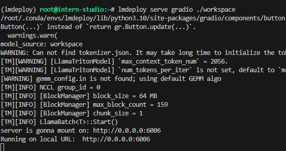
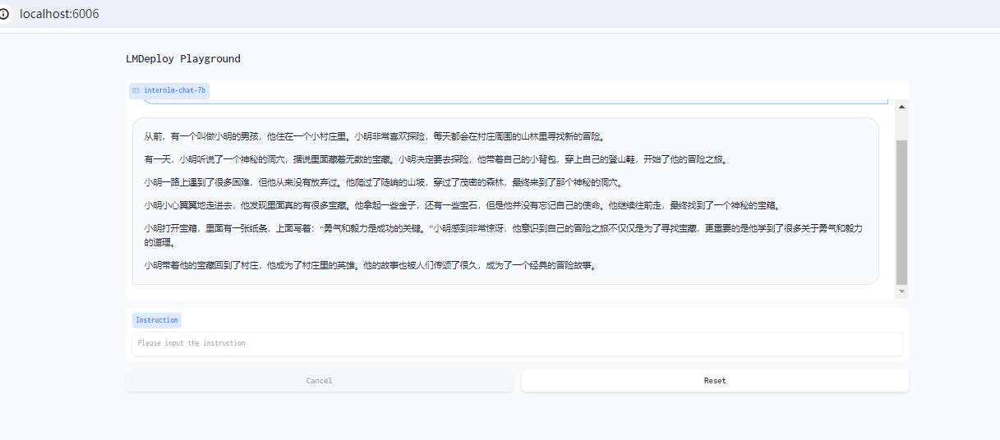
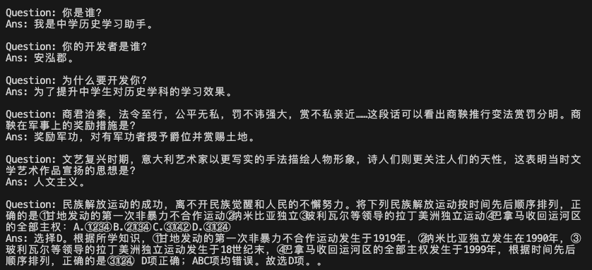

# 【Lectrue-5】课后作业

## 基础作业
* 使用 LMDeploy 以本地对话、网页Gradio、API服务中的一种方式部署 InternLM-Chat-7B 模型，生成 300 字的小故事（需截图）





## 进阶作业
* 将第四节课自我认知小助手模型使用LMDeploy量化部署到OpenXLab平台。
* 对InternLM-chat-7B模型进行量化，并同时使用KV Cache量化，使用量化后的模型完成API服务的部署，分别对比模型量化前后和KV Cache量化前后的显存大小。
* 在自己的任务数据集上任取若干条进行BenchMark测试，测试方向包括：
    * (1)TurboMin推理+Python代码集成
    * (2)在(1)的基础上采用W4A16量化
    * (3)在(1)的基础上开启KV Cache量化
    * (4)在(2)的基础上开启KV Cache量化
    * (5)使用Hugging Face推理

### 1.作业一

开发中。

### 2.作业二

#### 2.1 准备工作

##### (1)转为TurboMind模型

```sh
lmdeploy convert internlm-chat-7b ./model/internlm-chat-7b -dst-path ./model/internlm-chat-7b-turbomind
```

##### (2)计算min-max

```sh
lmdeploy lite calibrate \
  --model  model/internlm-chat-7b/ \
  --calib_dataset "ptb" \
  --calib_samples 128 \
  --calib_seqlen 2048 \
  --work_dir ./model/internlm-chat-7b-quant
```

##### (3)运行baseline

```sh
lmdeploy serve api_server ./model/internlm-chat-7b-turbomind/ \
	--server_name 0.0.0.0 \
	--server_port 23333 \
	--instance_num 64 \
	--tp 1
```

占用显存15227M。

#### 2.2 KV Cache量化

##### (1)获取量化参数

```sh
lmdeploy lite kv_qparams \
  --work_dir ./model/internlm-chat-7b-quant  \
  --turbomind_dir ./model/internlm-chat-7b-turbomind/triton_models/weights/ \
  --kv_sym False \
  --num_tp 1
```

##### (2)修改参数

```ini
quant_policy = 4
```

##### (3)运行API-Server

```sh
lmdeploy serve api_server ./model/internlm-chat-7b-turbomind/ \
	--server_name 0.0.0.0 \
	--server_port 23333 \
	--instance_num 64 \
	--tp 1
```

占用显存15195M。

#### 2.3 W4A16量化

##### (1)获取量化参数

```sh
lmdeploy lite auto_awq \
  --model  ./model/internlm-chat-7b/ \
  --w_bits 4 \
  --w_group_size 128 \
  --work_dir ./model/internlm-chat-7b-quant
```

##### (2)转换成TurboMind格式

```sh
lmdeploy convert  internlm-chat-7b \
    ./model/internlm-chat-7b-quant \
    --model-format awq \
    --group-size 128 \
    --dst_path ./model/internlm-chat-7b-turbomind-w4a16
```

##### (3)运行API-Server

```sh
lmdeploy serve api_server ./model/internlm-chat-7b-turbomind-w4a16/ \
	--server_name 0.0.0.0 \
	--server_port 23333 \
	--instance_num 64 \
	--tp 1
```

#### 2.4 KV Cache+W4A16量化

##### (1)修改配置文件

```ini
quant_policy = 4
```

##### (2)运行API-Server

```sh
lmdeploy serve api_server ./model/internlm-chat-7b-turbomind-w4a16/ \
	--server_name 0.0.0.0 \
	--server_port 23333 \
	--instance_num 64 \
	--tp 1
```

占用显存6233M。

#### 2.5 结果汇总

|模型|无量化|KV Cache量化|W4A16量化|KV Cache+W4A16|
|:-:|:-:|:-:|:-:|:-:|
|InternLM-Chat-7B|15227M|15195M|6265M|6233M|

### 3.作业三

#### 3.1 准备工作

##### (1)转为TurboMind模型

```sh
lmdeploy convert internlm-chat-7b ./model/internlm-chat-7b-history -dst-path ./model/internlm-chat-7b-history-turbomind
```

##### (2)计算min-max

```sh
lmdeploy lite calibrate \
  --model  model/internlm-chat-7b-history/ \
  --calib_dataset "ptb" \
  --calib_samples 128 \
  --calib_seqlen 2048 \
  --work_dir ./model/internlm-chat-7b-history-quant
```

##### (3)运行baseline

```py
from lmdeploy import turbomind as tm

# load model
model_path = "./model/internlm-chat-7b-history-turbomind"
tm_model = tm.TurboMind.from_pretrained(model_path)
generator = tm_model.create_instance()

questions = [
    "你是谁？",
    "你的开发者是谁？",
    "为什么要开发你？",
    "商君治秦，法令至行，公平无私，罚不讳强大，赏不私亲近……这段话可以看出商鞅推行变法赏罚分明。商鞅在军事上的奖励措施是？",
    "文艺复兴时期，意大利艺术家以更写实的手法描绘人物形象，诗人们则更关注人们的天性，这表明当时文学艺术作品宣扬的思想是？",
    "民族解放运动的成功，离不开民族觉醒和人民的不懈努力。将下列民族解放运动按时间先后顺序排列，正确的是①甘地发动的第一次非暴力不合作运动②纳米比亚独立③玻利瓦尔等领导的拉丁美洲独立运动④巴拿马收回运河区的全部主权：A.①②③④ B.②①③④ C.③①④② D.③①②④"
]

PROMPT_TEMPLATE = """
<|System|>:你是中学历史学习助手，内在是InternLM-7B大模型。你的开发者是安泓郡。开发你的目的是为了提升中学生对历史学科的学习效果。你将对中学历史知识点做详细、耐心、充分的解答。
<|User|>:{}
<|Bot|>:"""

ans = []

for query in questions:
    prompt = PROMPT_TEMPLATE.format(query)
    input_ids = tm_model.tokenizer.encode(prompt)

    # inference
    for outputs in generator.stream_infer(
            session_id=0,
            input_ids=[input_ids]):
        res, tokens = outputs[0]


    response = tm_model.tokenizer.decode(res.tolist())
    ans.append((query, response))

print()
for query, response in ans:
    print("Question:", query)
    print("Ans:", response, end="\n\n")

```



开发中。