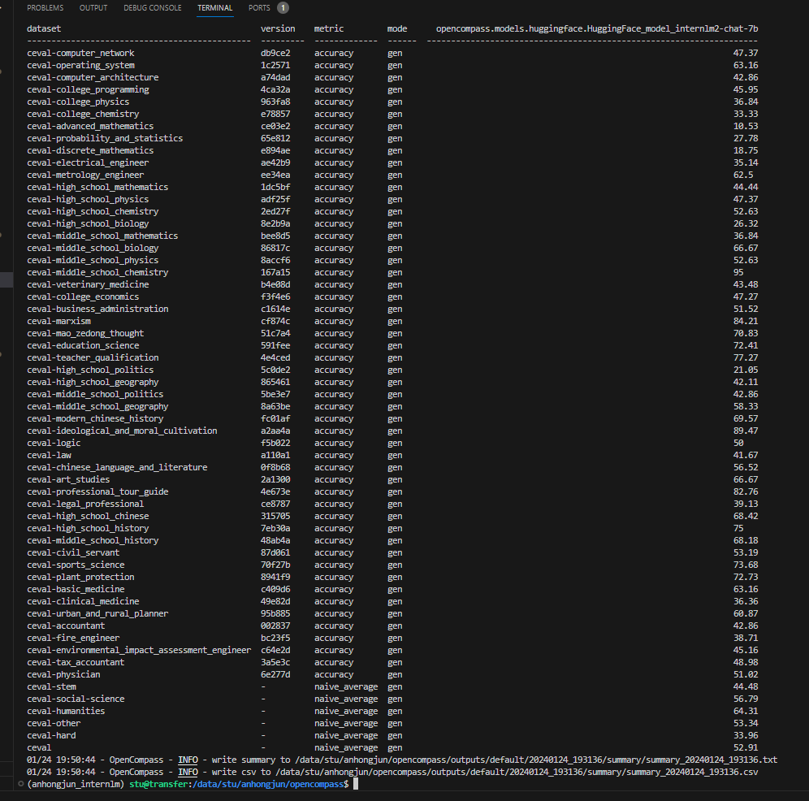
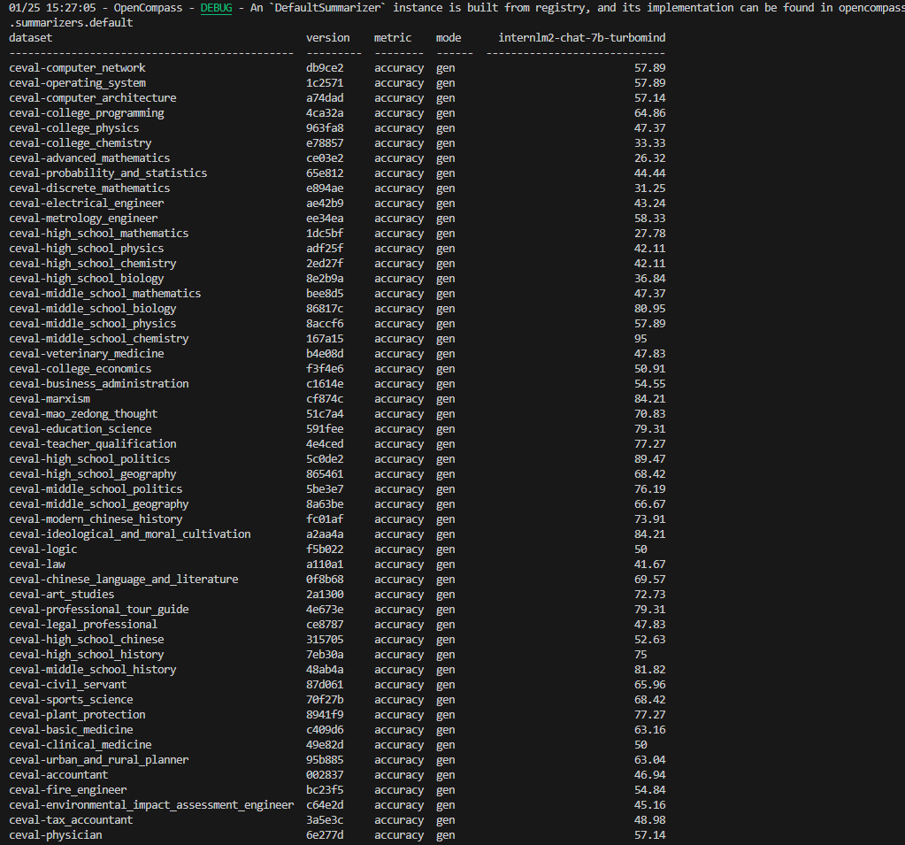

# 【Lectrue-6】课后作业

## 基础作业
* 使用 OpenCompass 评测 InternLM2-Chat-7B 模型在 C-Eval 数据集上的性能

### 1.下载InternLM2-Chat-7B模型

```sh
openxlab model download --model-repo 'OpenLMLab/internlm2-chat-7b'
```

### 2.下载并安装OpenCompass

```sh
git clone https://gitee.com/open-compass/opencompass.git
cd opencompass
pip install -e .
```

### 3.评测

```sh
python run.py \
    --datasets ceval_gen \
    --hf-path /data/stu/anhongjun/model/internlm2-chat-7b/ \
    --tokenizer-kwargs padding_side='left' truncation='left' trust_remote_code=True \
    --model-kwargs trust_remote_code=True device_map='auto' \
    --max-seq-len 2048 \
    --max-out-len 16 \
    --batch-size 4 \
    --num-gpus 1 \
    --debug
```
### 4.评测结果



## 进阶作业
* 使用 OpenCompass 评测 InternLM2-Chat-7B 模型使用 LMDeploy 0.2.0 部署后在 C-Eval 数据集上的性能

### 1.安装LMDeploy 0.2.0

```sh
pip install lmdeploy[all]==v0.2.0
```

### 2.修改配置文件

在`opencompass/configs`下新建文件`eval_internlm2_chat_7b_turbomind.py`：

```py
from mmengine.config import read_base
from opencompass.models.turbomind import TurboMindModel

with read_base():
    from .datasets.ceval.ceval_gen import ceval_datasets


datasets = sum((v for k, v in locals().items() if k.endswith('_datasets')), [])

internlm_meta_template = dict(round=[
    dict(role='HUMAN', begin='<|User|>:', end='\n'),
    dict(role='BOT', begin='<|Bot|>:', end='<eoa>\n', generate=True),
],
                              eos_token_id=103028)

# config for internlm2-chat-7b
internlm2_chat_7b = dict(
    type=TurboMindModel,
    abbr='internlm2-chat-7b-turbomind',
    path='/root/model/internlm2-chat-7b',
    engine_config=dict(session_len=2048,
                       max_batch_size=32,
                       rope_scaling_factor=1.0),
    gen_config=dict(top_k=1,
                    top_p=0.8,
                    temperature=1.0,
                    max_new_tokens=100),
    max_out_len=100,
    max_seq_len=2048,
    batch_size=32,
    concurrency=32,
    meta_template=internlm_meta_template,
    run_cfg=dict(num_gpus=1, num_procs=1),
)


models = [internlm2_chat_7b]
```

### 3.评测

```sh
python run.py configs/eval_internlm2_chat_7b_turbomind.py.py \
    -w outputs/turbomind/internlm2-chat-7b \
    --num-gpus 1 \
    --debug
```

### 4.评测结果

