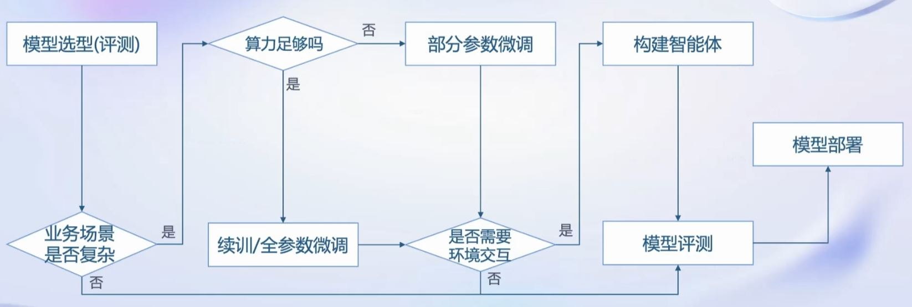
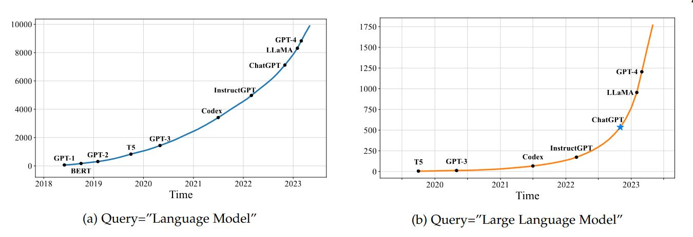
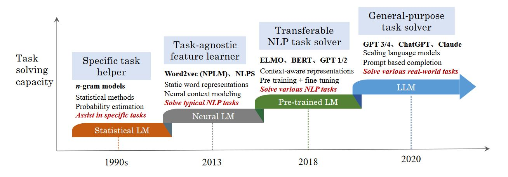
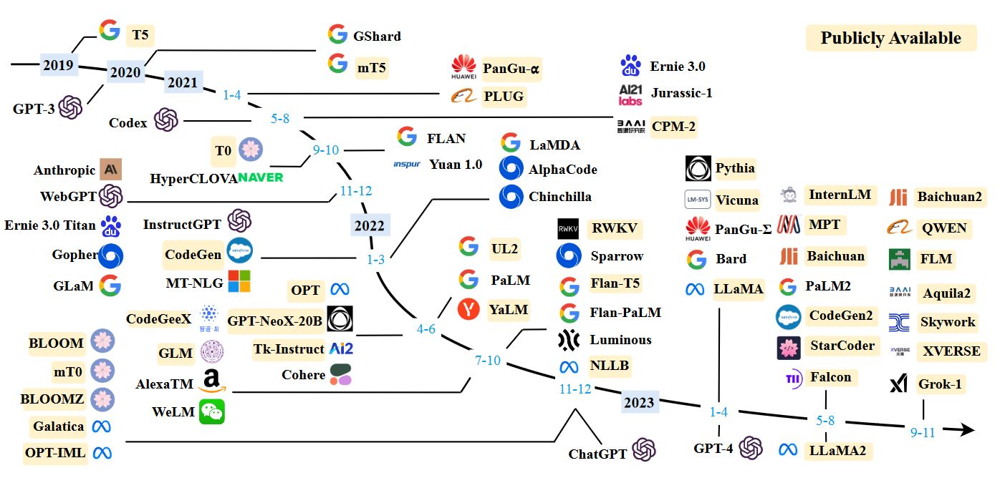

# 【Lecture 1】书生·浦语大模型全链路开源开放体系

未完成，学习更新中...

## 一、书生·浦语全链条开源开放体系
### 1.书生·浦语系列大模型

|名称|参数量|特点|适用b场景|
|:-|:-|:-|:-|
|InternLM-7B|70亿|小巧轻便，便于部署 支持8k语境窗口长度 支持多种工具调用模板|社区低成本可用最佳模型规模|
|InternLM-20B|200亿|在模型能力和推理代价间取得平衡 采用深而窄的结构，降低推理计算量但提高了推理能力 4k训练语境长度，推理时可外推至16k|商业场景可开发定制高精度、较小模型规模
|InternLM-123B|1230亿|具备极强的推理能力、全面的知识覆盖、超强理解能力和对话能力 准确的API调用能力，可实现各类Agent|通用大模型能力全面覆盖、千亿模型规模|

### 2.书生·浦语全链条开源开放体系

* **数据**：书生·万卷，[OpenDataLab](https://opendatalab.com/)
  * 2TB数据，涵盖多种模态与任务
  * 支持30+种模态
* **预训练**：[InternLM-Train](https://github.com/InternLM/InternLM/blob/main/doc/en/usage.md)
  * 支持8卡到千卡训练
  * 速度达到3600 tokens/sec/gpu
* **微调**：[XTuner](https://github.com/InternLM/xtuner)
  * 支持增量续训
  * 支持全参数微调
  * 支持LoRA等低成本微调
* **部署**：[LMDeploy](https://github.com/InternLM/lmdeploy)
  * 每秒生成2000+ tokens
* **评测**：[OpenCompass](https://github.com/open-compass/opencompass)
  * 80套评测集，40万道题目，全方位评测
* **应用**：[Lagent](https://github.com/InternLM/lagent)，[AgentLego](https://github.com/InternLM/agentlego)
  * 支持多种智能体，支持代码解释器等多种工具

## 二、大预言模型简介

### 1.大模型概述
#### 1.1 大模型的发展历程
由针对特定任务的专用模型，发展到应对多种任务和模态的通用的模型。

**大模型已发展成为通用人工智能的重要途经！**

> <small> **Reference**: Zhao W X, Zhou K, Li J, et al. A survey of large language models[J]. arXiv preprint arXiv:2303.18223, 2023.</small>

#### 1.2 常见大模型

### 2.大语言模型的能力
#### 2.1 涌现能力(Emergent Abilities)

* **涌现能力**指的是一种令人惊讶的能力，它在小型模型中不明显，但在大型模型中显著出现。可以类比到物理学中的相变现象，涌现能力的显现就像是模型性能随着规模增大而迅速提升，超过了随机水平，也就是我们常说的量变引起了质变。
* 三个典型的涌现能力：
  * **上下文学习**：由 GPT-3 首次引入的。这种能力允许语言模型在提供自然语言指令或多个任务示例的情况下，通过理解上下文并生成相应输出的方式来执行任务，而无需额外的训练或参数更新。
  * **指令遵循**：意味着LLM能够根据任务指令执行任务，而无需事先见过具体示例，这展示了其强大的泛化能力。
  * **逐步推理**：LLM通过采用"思维链"推理策略，可以利用包含中间推理步骤的提示机制来解决这些任务，从而得出最终答案。据推测，这种能力可能是通过对代码的训练获得的。
* 区分大语言模型（LLM）与以前的预训练语言模型（PLM）最显著的特征之一是它们的**涌现能力**。

#### 2.2 作为基座模型支持多元应用的能力
* 这是一种全新的AI技术范式，借助于海量无标注数据的训练，获得可以适用于大量下游任务的大模型（单模态或者多模态）。这样，多个应用可以只依赖于一个或少数几个大模型进行统一建设。

#### 2.3 支持对话作为同意入口的能力

### 3.大模型的特点
* **巨大的规模**： LLM通常具有巨大的参数规模，可以达到数十亿甚至数千亿个参数。这使得它们能够捕捉更多的语言知识和复杂的语法结构。
* **预训练和微调**： LLM采用了预训练和微调的学习方法。它们首先在大规模文本数据上进行预训练（无标签数据），学会了通用的语言表示和知识，然后通过微调（有标签数据）适应特定任务，从而在各种NLP任务中表现出色。
* **上下文感知**： LLM在处理文本时具有强大的上下文感知能力，能够理解和生成依赖于前文的文本内容。这使得它们在对话、文章生成和情境理解方面表现出色。
* **多语言支持**： LLM可以用于多种语言，不仅限于英语。它们的多语言能力使得跨文化和跨语言的应用变得更加容易。
* **多模态支持**： 一些LLM已经扩展到支持多模态数据，包括文本、图像和语音。这意味着它们可以理解和生成不同媒体类型的内容，实现更多样化的应用。
* **涌现能力**： LLM表现出令人惊讶的涌现能力，即在大规模模型中出现但在小型模型中不明显的性能提升。这使得它们能够处理更复杂的任务和问题。
* **多领域应用**： LLM已经被广泛应用于文本生成、自动翻译、信息检索、摘要生成、聊天机器人、虚拟助手等多个领域，对人们的日常生活和工作产生了深远的影响。
* **伦理和风险问题**： 尽管LLM具有出色的能力，但它们也引发了伦理和风险问题，包括生成有害内容、隐私问题、认知偏差等。因此，研究和应用LLM需要谨慎。

## 三、LangChain
### 1.LangChain简介
LangChain 框架是一个开源工具，充分利用了大型语言模型的强大能力，以便开发各种下游应用。它的目标是为各种大型语言模型应用提供通用接口，从而简化应用程序的开发流程。具体来说，LangChain 框架可以实现数据感知和环境互动，也就是说，它能够让语言模型与其他数据来源连接，并且允许语言模型与其所处的环境进行互动。
### 2.LangChain核心组件
* **模型输入/输出（Model I/O）**：与语言模型交互的接口。
* **数据连接（Data connection）**：与特定应用程序的数据进行交互的接口。
* **链（Chains）**：将组件组合实现端到端应用。
* **记忆（Memory）**：用于链的多次运行之间持久化应用程序状态。
* **代理（Agents）**：扩展模型的推理能力，用于复杂的应用的调用序列。
* **回调（Callbacks）**：扩展模型的推理能力，用于复杂的应用的调用序列。