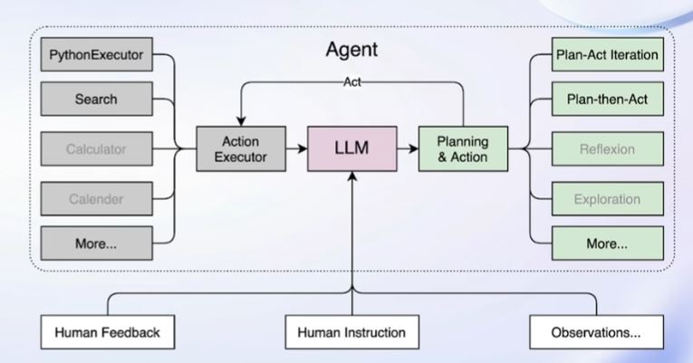

# 【Lecture 2】轻松分钟玩转书生·浦语大模型趣味 Demo

未完成，更新学习中……

## 一、大模型及InternLM模型介绍
### 1.什么是大模型？

人工智能领域中**参数数量巨大、拥有庞大计算能力和参数规模**的模型。

### 2.特点及应用

* 利用大量数据进行训练。
* 拥有数十亿甚至数千亿个参数。
* 模型在各种任务中展现出惊人的性能。

### 3.InternLM模型介绍

* 上海人工智能实验室开源的轻量级训练框架。
* 已发布**InternLM-7B**和**InternLM-20B**两个开源与训练模型。
* 通过单一代码库，InternLM支持在拥有数千个GPU的大型集群上进行**预训练**，并在**单个GPU上进行微调**，同时实现了卓越的性能优化。
* 1024个GPU上训练可以实现近90%的加速效率。
* InternLM-7B包含了一个拥有**70亿参数的基础模型**和一个为**实际场景量身定制**的对话模型。特点：
  * 利用**数万亿的高质量token进行训练**，建立了一个强大的知识库。
  * 支持**8k token的上下文窗口长度**，使得输入序列更长并增强了推理能力。

### 4.Lagent介绍



* 轻量级、开源的大语言模型**智能体**框架。
* 将大语言模型转变为多种类型的智能体。
* Lagent框架可以更好的发挥InternLM模型的全部性能。

### 5.浦语·灵笔介绍

* 基于**书生·浦语大语言模型**研发的**视觉·语言大模型**。
* 有出色的**图文理解**和**创作**能力。
* 可以输出图文并茂的专属文章。

## 二、通用环境配置

### 1.pip、conda换源
设置pip默认镜像源，省级pip到最新的版本(>=10.0.0)后进行配置
```sh
python -m pip install --upgrade pip
pip config set global.index-url https://mirrors.cernet.edu.cn/pypi/web/simple
```

conda快速换源
```sh
cat <<'EOF' > ~/.condarc
channels:
  - defaults
show_channel_urls: true
default_channels:
  - https://mirrors.tuna.tsinghua.edu.cn/anaconda/pkgs/main
  - https://mirrors.tuna.tsinghua.edu.cn/anaconda/pkgs/r
  - https://mirrors.tuna.tsinghua.edu.cn/anaconda/pkgs/msys2
custom_channels:
  conda-forge: https://mirrors.tuna.tsinghua.edu.cn/anaconda/cloud
  pytorch: https://mirrors.tuna.tsinghua.edu.cn/anaconda/cloud
EOF
```

### 2.模型下载
#### Hugging Face方式下载
下载使用Hugging Face官方提供的`huggingface-cli`命令行工具。
```sh
pip install -U huggingface_hub
huggingface-cli download --resume-download internlm/internlm-chat-7b --local-dir your_path
```

#### OpenXLab方式下载
OpenXLab可以通过指定模型仓库的地址，以及需要下载的文件的名称，文件所需下载的位置等，直接下载权重文件。

首先安装依赖项：
```sh
pip install -U openxlab
```

然后在python文件中写入以下代码：
```python
from openxlab.model import download
download(model_repo='OpenLMLab/InternLM-7b', model_name='InternLM-7b', output='your local path')
```

#### ModelScope方式下载
使用modelscope中的`snapshot_download`函数下载模型，参数`cache_dir`为模型的下载路径。

首先安装依赖：
```sh
pip install modelscope
pip install transformers
```

在当前目录下新建python文件，填入以下代码运行。
```py
import pytorch
from modelscope import snapshot_download, AutoModel, AutoTokenizer
import os

model_dir = snapshot_download('Shanghai_AI_Laboratory/internlm-chat-7b', cache_dir='your path', revision='master')
```


## 三、InternLM-Chat-7B智能对话Demo

### 1.环境准备

创建开发机，进入开发机终端配置环境。

输入`bash`，进入`conda`环境。

克隆一个含有`pytorch2.0.1`的环境。

```sh
conda create --name internlm-demo --clone=/root/share/conda_envs/internlm-base
```

激活环境。

```sh
conda activate interlm-demo
```

安装所需依赖
```sh
# 升级pip
python -m pip install --upgrade pip

pip install modelscope==1.9.5
pip install transformers==4.35.2
pip install streamlit==1.24.0
pip install sentencepiece==0.1.99
pip install accelerate==0.24.1
```

### 2.模型下载

#### 直接复制模型方式

```sh
mkdir -p /root/model/Shanghai_AI_Laboratory
cp -r /root/share/temp/model_repos/internlm-chat-7b /root/model/Shanghai_AI_Laboratory
```

#### Modelscope下载模型方式

```sh
import torch
from modelscope import snapshot_download, AutoModel, AutoTokenizer
import os
model_dir = snapshot_download('Shanghai_AI_Laboratory/internlm-chat-7b', cache_dir='/root/model', revision='v1.0.3')
```


### 3.代码准备
克隆目录。

```sh
cd /root/code
git clone https://gitee.com/internlm/InternLM.git
```

切换commit版本。

```sh
cd InternLM
git checkout 3028f07cb79e5b1d7342f4ad8d11efad3fd13d17
```

修改`/root/code/InternLM/web_demo.py`第29行和第33行路径为本地`/root/model/Shanghai_AI_Laboratory/internlm-chat-7b`。

### 4.终端运行
在`/root/code/InternLM`目录下新建`cli_demo.py`文件，写入代码：

```py
import torch
from transformers import AutoTokenizer, AutoModelForCausalLM


model_name_or_path = "/root/model/Shanghai_AI_Laboratory/internlm-chat-7b"

tokenizer = AutoTokenizer.from_pretrained(model_name_or_path, trust_remote_code=True)
model = AutoModelForCausalLM.from_pretrained(model_name_or_path, trust_remote_code=True, torch_dtype=torch.bfloat16, device_map='auto')
model = model.eval()

system_prompt = """You are an AI assistant whose name is InternLM (书生·浦语).
- InternLM (书生·浦语) is a conversational language model that is developed by Shanghai AI Laboratory (上海人工智能实验室). It is designed to be helpful, honest, and harmless.
- InternLM (书生·浦语) can understand and communicate fluently in the language chosen by the user such as English and 中文.
"""

messages = [(system_prompt, '')]

print("=============Welcome to InternLM chatbot, type 'exit' to exit.=============")

while True:
    input_text = input("User  >>> ")
    input_text = input_text.replace(' ', '')
    if input_text == "exit":
        break
    response, history = model.chat(tokenizer, input_text, history=messages)
    messages.append((input_text, response))
    print(f"robot >>> {response}")
```

在终端运行。

```sh
python /root/code/InternLM/cli_demo.py
```

### 5.Web-Demo运行

切换到`VSCode`，运行`/root/code/InternLM`目录下的`web_demo.py`文件。配置本地端口后，运行如下指令：

```
bash
conda activate internlm-demo  # 首次进入 vscode 会默认是 base 环境，所以首先切换环境
cd /root/code/InternLM
streamlit run web_demo.py --server.address 127.0.0.1 --server.port 6006
```

在本地浏览器输入`http://127.0.0.1:6006`打开界面。


## 四、Lagent智能体工具调用Demo

## 五、浦语·灵笔图文创作理解Demo
