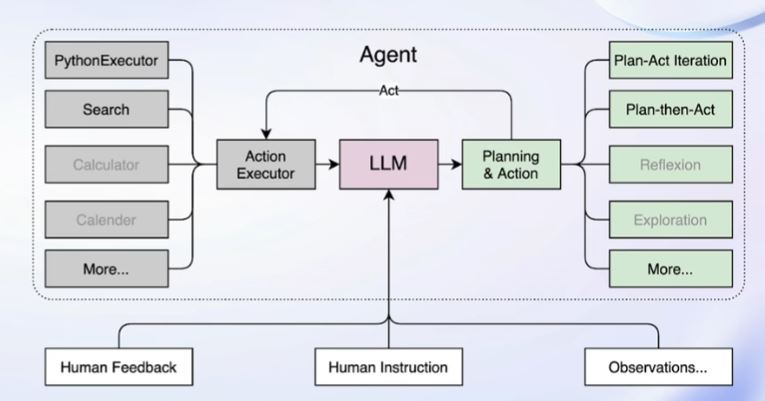

# 【Lecture 2】轻松分钟玩转书生·浦语大模型趣味 Demo

## 一、大模型及InternLM模型介绍
### 1.什么是大模型？

人工智能领域中**参数数量巨大、拥有庞大计算能力和参数规模**的模型。

### 2.特点及应用

* 利用大量数据进行训练。
* 拥有数十亿甚至数千亿个参数。
* 模型在各种任务中展现出惊人的性能。

### 3.InternLM模型介绍

* 上海人工智能实验室开源的轻量级训练框架。
* 已发布**InternLM-7B**和**InternLM-20B**两个开源与训练模型。
* 通过单一代码库，InternLM支持在拥有数千个GPU的大型集群上进行**预训练**，并在**单个GPU上进行微调**，同时实现了卓越的性能优化。
* 1024个GPU上训练可以实现近90%的加速效率。
* InternLM-7B包含了一个拥有**70亿参数的基础模型**和一个为**实际场景量身定制**的对话模型。特点：
  * 利用**数万亿的高质量token进行训练**，建立了一个强大的知识库。
  * 支持**8k token的上下文窗口长度**，使得输入序列更长并增强了推理能力。

### 4.Lagent介绍



* 轻量级、开源的大语言模型**智能体**框架。
* 将大语言模型转变为多种类型的智能体。
* Lagent框架可以更好的发挥InternLM模型的全部性能。

### 5.浦语·灵笔介绍

* 基于**书生·浦语大语言模型**研发的**视觉·语言大模型**。
* 有出色的**图文理解**和**创作**能力。
* 可以输出图文并茂的专属文章。

## 二、通用环境配置

### 1.pip、conda换源
设置pip默认镜像源，省级pip到最新的版本(>=10.0.0)后进行配置
```sh
python -m pip install --upgrade pip
pip config set global.index-url https://mirrors.cernet.edu.cn/pypi/web/simple
```

conda快速换源
```sh
cat <<'EOF' > ~/.condarc
channels:
  - defaults
show_channel_urls: true
default_channels:
  - https://mirrors.tuna.tsinghua.edu.cn/anaconda/pkgs/main
  - https://mirrors.tuna.tsinghua.edu.cn/anaconda/pkgs/r
  - https://mirrors.tuna.tsinghua.edu.cn/anaconda/pkgs/msys2
custom_channels:
  conda-forge: https://mirrors.tuna.tsinghua.edu.cn/anaconda/cloud
  pytorch: https://mirrors.tuna.tsinghua.edu.cn/anaconda/cloud
EOF
```

### 2.模型下载
#### Hugging Face方式下载
下载使用Hugging Face官方提供的`huggingface-cli`命令行工具。
```sh
pip install -U huggingface_hub
huggingface-cli download --resume-download internlm/internlm-chat-7b --local-dir your_path
```

#### OpenXLab方式下载
OpenXLab可以通过指定模型仓库的地址，以及需要下载的文件的名称，文件所需下载的位置等，直接下载权重文件。

首先安装依赖项：
```sh
pip install -U openxlab
```

然后在python文件中写入以下代码：
```python
from openxlab.model import download
download(model_repo='OpenLMLab/InternLM-7b', model_name='InternLM-7b', output='your local path')
```

#### ModelScope方式下载
使用modelscope中的`snapshot_download`函数下载模型，参数`cache_dir`为模型的下载路径。

首先安装依赖：
```sh
pip install modelscope
pip install transformers
```

在当前目录下新建python文件，填入以下代码运行。
```py
import pytorch
from modelscope import snapshot_download, AutoModel, AutoTokenizer
import os

model_dir = snapshot_download('Shanghai_AI_Laboratory/internlm-chat-7b', cache_dir='your path', revision='master')
```


## 三、InternLM-Chat-7B智能对话Demo

### 1.环境准备

创建开发机，进入开发机终端配置环境。

输入`bash`，进入`conda`环境。

克隆一个含有`pytorch2.0.1`的环境。

```sh
conda create --name internlm-demo --clone=/root/share/conda_envs/internlm-base
```

激活环境。

```sh
conda activate interlm-demo
```

安装所需依赖
```sh
# 升级pip
python -m pip install --upgrade pip

pip install modelscope==1.9.5
pip install transformers==4.35.2
pip install streamlit==1.24.0
pip install sentencepiece==0.1.99
pip install accelerate==0.24.1
```

### 2.模型下载

#### 直接复制模型方式

```sh
mkdir -p /root/model/Shanghai_AI_Laboratory
cp -r /root/share/temp/model_repos/internlm-chat-7b /root/model/Shanghai_AI_Laboratory
```

#### Modelscope下载模型方式

```sh
import torch
from modelscope import snapshot_download, AutoModel, AutoTokenizer
import os
model_dir = snapshot_download('Shanghai_AI_Laboratory/internlm-chat-7b', cache_dir='/root/model', revision='v1.0.3')
```


### 3.代码准备
克隆目录。

```sh
cd /root/code
git clone https://gitee.com/internlm/InternLM.git
```

切换commit版本。

```sh
cd InternLM
git checkout 3028f07cb79e5b1d7342f4ad8d11efad3fd13d17
```

修改`/root/code/InternLM/web_demo.py`第29行和第33行路径为本地`/root/model/Shanghai_AI_Laboratory/internlm-chat-7b`。

### 4.终端运行
在`/root/code/InternLM`目录下新建`cli_demo.py`文件，写入代码：

```py
import torch
from transformers import AutoTokenizer, AutoModelForCausalLM


model_name_or_path = "/root/model/Shanghai_AI_Laboratory/internlm-chat-7b"

tokenizer = AutoTokenizer.from_pretrained(model_name_or_path, trust_remote_code=True)
model = AutoModelForCausalLM.from_pretrained(model_name_or_path, trust_remote_code=True, torch_dtype=torch.bfloat16, device_map='auto')
model = model.eval()

system_prompt = """You are an AI assistant whose name is InternLM (书生·浦语).
- InternLM (书生·浦语) is a conversational language model that is developed by Shanghai AI Laboratory (上海人工智能实验室). It is designed to be helpful, honest, and harmless.
- InternLM (书生·浦语) can understand and communicate fluently in the language chosen by the user such as English and 中文.
"""

messages = [(system_prompt, '')]

print("=============Welcome to InternLM chatbot, type 'exit' to exit.=============")

while True:
    input_text = input("User  >>> ")
    input_text = input_text.replace(' ', '')
    if input_text == "exit":
        break
    response, history = model.chat(tokenizer, input_text, history=messages)
    messages.append((input_text, response))
    print(f"robot >>> {response}")
```

在终端运行。

```sh
python /root/code/InternLM/cli_demo.py
```

### 5.Web-Demo运行

切换到`VSCode`，运行`/root/code/InternLM`目录下的`web_demo.py`文件。配置本地端口后，运行如下指令：

```
bash
conda activate internlm-demo  # 首次进入 vscode 会默认是 base 环境，所以首先切换环境
cd /root/code/InternLM
streamlit run web_demo.py --server.address 127.0.0.1 --server.port 6006
```

在本地浏览器输入`http://127.0.0.1:6006`打开界面。


## 四、Lagent智能体工具调用Demo

### 1.环境准备

创建开发机，进入开发机终端配置环境。

输入`bash`，进入`conda`环境。

克隆一个含有`pytorch2.0.1`的环境。

```sh
conda create --name internlm-demo --clone=/root/share/conda_envs/internlm-base
```

激活环境。

```sh
conda activate interlm-demo
```

安装所需依赖
```sh
# 升级pip
python -m pip install --upgrade pip

pip install modelscope==1.9.5
pip install transformers==4.35.2
pip install streamlit==1.24.0
pip install sentencepiece==0.1.99
pip install accelerate==0.24.1
```

### 2.模型下载

#### 直接复制模型方式

```sh
mkdir -p /root/model/Shanghai_AI_Laboratory
cp -r /root/share/temp/model_repos/internlm-chat-7b /root/model/Shanghai_AI_Laboratory
```

#### Modelscope下载模型方式

```sh
import torch
from modelscope import snapshot_download, AutoModel, AutoTokenizer
import os
model_dir = snapshot_download('Shanghai_AI_Laboratory/internlm-chat-7b', cache_dir='/root/model', revision='v1.0.3')
```

### 3.Lagent安装

首先下载`Lagent`源代码。

```sh
cd /root/code
git clone https://gitee.com/internlm/lagent.git
```

由源码安装`Lagent`。

```sh
cd /root/code/lagent
git checkout 511b03889010c4811b1701abb153e02b8e94fb5e # 尽量保证和教程commit版本一致
pip install -e . # 源码安装
```

### 4.修改代码

将`/root/code/lagent/examples/react_web_demo.py`内容替换为以下代码：

```py
import copy
import os

import streamlit as st
from streamlit.logger import get_logger

from lagent.actions import ActionExecutor, GoogleSearch, PythonInterpreter
from lagent.agents.react import ReAct
from lagent.llms import GPTAPI
from lagent.llms.huggingface import HFTransformerCasualLM


class SessionState:

    def init_state(self):
        """Initialize session state variables."""
        st.session_state['assistant'] = []
        st.session_state['user'] = []

        #action_list = [PythonInterpreter(), GoogleSearch()]
        action_list = [PythonInterpreter()]
        st.session_state['plugin_map'] = {
            action.name: action
            for action in action_list
        }
        st.session_state['model_map'] = {}
        st.session_state['model_selected'] = None
        st.session_state['plugin_actions'] = set()

    def clear_state(self):
        """Clear the existing session state."""
        st.session_state['assistant'] = []
        st.session_state['user'] = []
        st.session_state['model_selected'] = None
        if 'chatbot' in st.session_state:
            st.session_state['chatbot']._session_history = []


class StreamlitUI:

    def __init__(self, session_state: SessionState):
        self.init_streamlit()
        self.session_state = session_state

    def init_streamlit(self):
        """Initialize Streamlit's UI settings."""
        st.set_page_config(
            layout='wide',
            page_title='lagent-web',
            page_icon='./docs/imgs/lagent_icon.png')
        # st.header(':robot_face: :blue[Lagent] Web Demo ', divider='rainbow')
        st.sidebar.title('模型控制')

    def setup_sidebar(self):
        """Setup the sidebar for model and plugin selection."""
        model_name = st.sidebar.selectbox(
            '模型选择：', options=['gpt-3.5-turbo','internlm'])
        if model_name != st.session_state['model_selected']:
            model = self.init_model(model_name)
            self.session_state.clear_state()
            st.session_state['model_selected'] = model_name
            if 'chatbot' in st.session_state:
                del st.session_state['chatbot']
        else:
            model = st.session_state['model_map'][model_name]

        plugin_name = st.sidebar.multiselect(
            '插件选择',
            options=list(st.session_state['plugin_map'].keys()),
            default=[list(st.session_state['plugin_map'].keys())[0]],
        )

        plugin_action = [
            st.session_state['plugin_map'][name] for name in plugin_name
        ]
        if 'chatbot' in st.session_state:
            st.session_state['chatbot']._action_executor = ActionExecutor(
                actions=plugin_action)
        if st.sidebar.button('清空对话', key='clear'):
            self.session_state.clear_state()
        uploaded_file = st.sidebar.file_uploader(
            '上传文件', type=['png', 'jpg', 'jpeg', 'mp4', 'mp3', 'wav'])
        return model_name, model, plugin_action, uploaded_file

    def init_model(self, option):
        """Initialize the model based on the selected option."""
        if option not in st.session_state['model_map']:
            if option.startswith('gpt'):
                st.session_state['model_map'][option] = GPTAPI(
                    model_type=option)
            else:
                st.session_state['model_map'][option] = HFTransformerCasualLM(
                    '/root/model/Shanghai_AI_Laboratory/internlm-chat-7b')
        return st.session_state['model_map'][option]

    def initialize_chatbot(self, model, plugin_action):
        """Initialize the chatbot with the given model and plugin actions."""
        return ReAct(
            llm=model, action_executor=ActionExecutor(actions=plugin_action))

    def render_user(self, prompt: str):
        with st.chat_message('user'):
            st.markdown(prompt)

    def render_assistant(self, agent_return):
        with st.chat_message('assistant'):
            for action in agent_return.actions:
                if (action):
                    self.render_action(action)
            st.markdown(agent_return.response)

    def render_action(self, action):
        with st.expander(action.type, expanded=True):
            st.markdown(
                "<p style='text-align: left;display:flex;'> <span style='font-size:14px;font-weight:600;width:70px;text-align-last: justify;'>插    件</span><span style='width:14px;text-align:left;display:block;'>:</span><span style='flex:1;'>"  # noqa E501
                + action.type + '</span></p>',
                unsafe_allow_html=True)
            st.markdown(
                "<p style='text-align: left;display:flex;'> <span style='font-size:14px;font-weight:600;width:70px;text-align-last: justify;'>思考步骤</span><span style='width:14px;text-align:left;display:block;'>:</span><span style='flex:1;'>"  # noqa E501
                + action.thought + '</span></p>',
                unsafe_allow_html=True)
            if (isinstance(action.args, dict) and 'text' in action.args):
                st.markdown(
                    "<p style='text-align: left;display:flex;'><span style='font-size:14px;font-weight:600;width:70px;text-align-last: justify;'> 执行内容</span><span style='width:14px;text-align:left;display:block;'>:</span></p>",  # noqa E501
                    unsafe_allow_html=True)
                st.markdown(action.args['text'])
            self.render_action_results(action)

    def render_action_results(self, action):
        """Render the results of action, including text, images, videos, and
        audios."""
        if (isinstance(action.result, dict)):
            st.markdown(
                "<p style='text-align: left;display:flex;'><span style='font-size:14px;font-weight:600;width:70px;text-align-last: justify;'> 执行结果</span><span style='width:14px;text-align:left;display:block;'>:</span></p>",  # noqa E501
                unsafe_allow_html=True)
            if 'text' in action.result:
                st.markdown(
                    "<p style='text-align: left;'>" + action.result['text'] +
                    '</p>',
                    unsafe_allow_html=True)
            if 'image' in action.result:
                image_path = action.result['image']
                image_data = open(image_path, 'rb').read()
                st.image(image_data, caption='Generated Image')
            if 'video' in action.result:
                video_data = action.result['video']
                video_data = open(video_data, 'rb').read()
                st.video(video_data)
            if 'audio' in action.result:
                audio_data = action.result['audio']
                audio_data = open(audio_data, 'rb').read()
                st.audio(audio_data)


def main():
    logger = get_logger(__name__)
    # Initialize Streamlit UI and setup sidebar
    if 'ui' not in st.session_state:
        session_state = SessionState()
        session_state.init_state()
        st.session_state['ui'] = StreamlitUI(session_state)

    else:
        st.set_page_config(
            layout='wide',
            page_title='lagent-web',
            page_icon='./docs/imgs/lagent_icon.png')
        # st.header(':robot_face: :blue[Lagent] Web Demo ', divider='rainbow')
    model_name, model, plugin_action, uploaded_file = st.session_state[
        'ui'].setup_sidebar()

    # Initialize chatbot if it is not already initialized
    # or if the model has changed
    if 'chatbot' not in st.session_state or model != st.session_state[
            'chatbot']._llm:
        st.session_state['chatbot'] = st.session_state[
            'ui'].initialize_chatbot(model, plugin_action)

    for prompt, agent_return in zip(st.session_state['user'],
                                    st.session_state['assistant']):
        st.session_state['ui'].render_user(prompt)
        st.session_state['ui'].render_assistant(agent_return)
    # User input form at the bottom (this part will be at the bottom)
    # with st.form(key='my_form', clear_on_submit=True):

    if user_input := st.chat_input(''):
        st.session_state['ui'].render_user(user_input)
        st.session_state['user'].append(user_input)
        # Add file uploader to sidebar
        if uploaded_file:
            file_bytes = uploaded_file.read()
            file_type = uploaded_file.type
            if 'image' in file_type:
                st.image(file_bytes, caption='Uploaded Image')
            elif 'video' in file_type:
                st.video(file_bytes, caption='Uploaded Video')
            elif 'audio' in file_type:
                st.audio(file_bytes, caption='Uploaded Audio')
            # Save the file to a temporary location and get the path
            file_path = os.path.join(root_dir, uploaded_file.name)
            with open(file_path, 'wb') as tmpfile:
                tmpfile.write(file_bytes)
            st.write(f'File saved at: {file_path}')
            user_input = '我上传了一个图像，路径为: {file_path}. {user_input}'.format(
                file_path=file_path, user_input=user_input)
        agent_return = st.session_state['chatbot'].chat(user_input)
        st.session_state['assistant'].append(copy.deepcopy(agent_return))
        logger.info(agent_return.inner_steps)
        st.session_state['ui'].render_assistant(agent_return)


if __name__ == '__main__':
    root_dir = os.path.dirname(os.path.dirname(os.path.abspath(__file__)))
    root_dir = os.path.join(root_dir, 'tmp_dir')
    os.makedirs(root_dir, exist_ok=True)
    main()
```

### 5.运行Demo

```sh
streamlit run /root/code/lagent/examples/react_web_demo.py --server.address 127.0.0.1 --server.port 6006
```

## 五、浦语·灵笔图文创作理解Demo

### 1.环境准备

新建一个`conda`环境。

```sh
/root/share/install_conda_env_internlm_base.sh xcomposer-demo
```

激活环境。

```sh
conda activate xcomposer-demo
```

安装依赖包。

```sh
pip install transformers==4.33.1 timm==0.4.12 sentencepiece==0.1.99 gradio==3.44.4 markdown2==2.4.10 xlsxwriter==3.1.2 einops accelerate
```

### 2.模型下载

#### 复制方式

```sh
mkdir -p /root/model/Shanghai_AI_Laboratory
cp -r /root/share/temp/model_repos/internlm-xcomposer-7b /root/model/Shanghai_AI_Laboratory
```

#### ModelScope方式

安装`modelscope`方式。

```sh
pip install modelscope==1.9.5
```

在`/root/model`路径下新建`download.py`，并运行以下内容。

```py
import torch
from modelscope import snapshot_download, AutoModel, AutoTokenizer
import os
model_dir = snapshot_download('Shanghai_AI_Laboratory/internlm-xcomposer-7b', cache_dir='/root/model', revision='master')
```

### 3.代码准备

下载代码仓库。

```sh
cd /root/code
git clone https://gitee.com/internlm/InternLM-XComposer.git
cd /root/code/InternLM-XComposer
git checkout 3e8c79051a1356b9c388a6447867355c0634932d  # 最好保证和教程的 commit 版本一致
```

### 4.运行Demo

```sh
cd /root/code/InternLM-XComposer
python examples/web_demo.py  \
    --folder /root/model/Shanghai_AI_Laboratory/internlm-xcomposer-7b \
    --num_gpus 1 \
    --port 6006
```