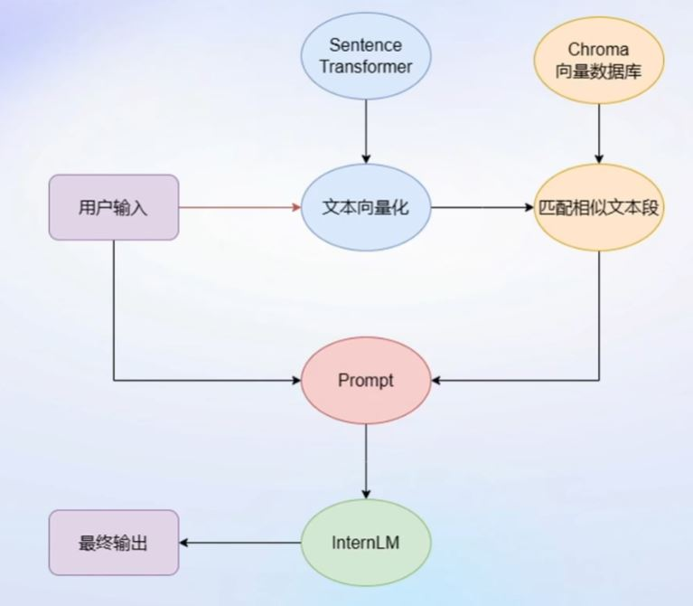
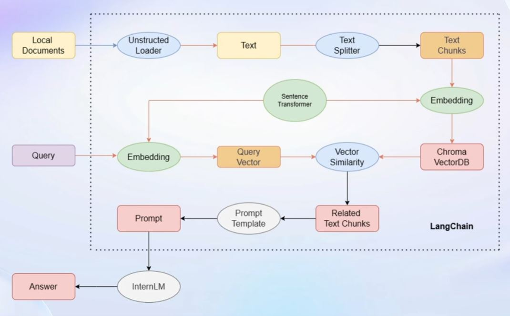

# 【Lecture 3】基于InternLM和LangChain搭建你的知识库

未完成，更新学习中...

## 一、大模型开发范式

### 1.LLM的局限性
* 知识时效性受限：如何让LLM能够获取最新的知识
* 专业能力有限：如何打造垂域大模型
* 定制化成本高：如何打造个人专属的LLM应用

### 2.两种开发范式-RAG v.s. Finetune

#### (1)RAG

给大模型外挂一个知识库，根据用户提问，首先到知识库匹配相关文档，然后将提问和文档一起交给大模型生成回答。



#### (2)Finetune

在一个轻量级的较小数据集上进行微调，从而提升模型在该新数据集上的能力。

#### (3)范式对比

两种范式**都可突破LLM的通用局限**，但各自特点如下：

|RAG|Finetune|
|:-:|:-:|
|低成本|成本高昂|
|可实时更新|无法实时更新|
|受基座模型影响大|可个性化微调|
|单次回答知识有限|知识覆盖面广|

## 二、LangChain简介

### 1.简介

LangChain框架是一个开源工具，通过为各种LLM提供通用接口来简化应用程序的开发流程，帮助开发者自由构建LLM应用。
### 2.LangChain的核心组成模块：

* 链(Chains)：将各组件组合实现端到端应用，通过一个对象封装实现一系列LLM操作。
  * E.g. 检索问答链，覆盖实现了RAG（检索增强生成）的全部流程



## 三、构建向量知识库

### 1.加载源文件
* 确定源文件类型，针对不同类型源文件选用不同的加载器
* 核心在于将带个是文本转化为无格式字符串

### 2.文档分块
* 由于单个文档往往超过模型上下文上限，我们需要对加载的文档进行切分
* 一般按照字符串长度进行分割
* 可以手动控制分割块的长度和重叠区间长度

### 3.文档向量化
* 使用向量数据库来支持语义检索，需要将文档向量化存入向量数据库
* 可以使用任意一种Embedding模型来进行向量化
* 可以使用多种支持语义检索的向量数据库，一般使用轻量级**Chroma**

## 四、搭建知识库助手
### 1.将InternLM接入LangChain
* LangChain支持自定义LLM，可以直接接入到框架中
* 只需将InternLM部署在本地，并封装一个自定义LLM类，调用本地InternLM即可

### 2.构建知识问答链
* LangChain提供了检索问答链模板，可以自动实现知识检索、Prompt嵌入、LLM问答的全部流程
* 将基于InternLM的自定义LLM和已构建的向量数据库接入到检索问答链的上游
* 调用检索问答链，即可实现知识库助手的核心功能

### 3.RAG方案优化建议
* 基于RAG的问答系统性能核心受限于：
  * 检索精度
  * Prompt性能
* 一些可能的优化点
  * 检索方面
    * 基于语义进行分割，保证每一个chunk的语义完整
    * 给每一个chunk生成概括性索引，检索时匹配索引
  * Prompt方面
    * 迭代优化Prompt策略

## 五、Web Demo部署

* Gradio
* Streamlit

## 六、动手实战环节

### 1.环境配置

#### (1)InternLM模型部署

创建conda环境。

```sh
/root/share/install_conda_env_internlm_base.sh InternLM
```

激活conda环境。

```sh
conda activate InternLM
```

安装依赖。

```sh
# 升级pip
python -m pip install --upgrade pip

pip install modelscope==1.9.5
pip install transformers==4.35.2
pip install streamlit==1.24.0
pip install sentencepiece==0.1.99
pip install accelerate==0.24.1
```

#### (2)模型下载

##### 本地拷贝方式
```sh
mkdir -p /root/data/model/Shanghai_AI_Laboratory
cp -r /root/share/temp/model_repos/internlm-chat-7b /root/data/model/Shanghai_AI_Laboratory/internlm-chat-7b
```

##### ModelScope下载方式

```py
import torch
from modelscope import snapshot_download, AutoModel, AutoTokenizer
import os
model_dir = snapshot_download('Shanghai_AI_Laboratory/internlm-chat-7b', cache_dir='/root/data/model', revision='v1.0.3')
```

#### (3)LangChain环境配置

安装如下依赖包。

```sh
pip install langchain==0.0.292
pip install gradio==4.4.0
pip install chromadb==0.4.15
pip install sentence-transformers==2.2.2
pip install unstructured==0.10.30
pip install markdown==3.3.7
```

安装huggingface。

```sh
pip install -U huggingface_hub
```

由hugginface下载Sentence-Transformer。
* 也可以选用别的开源词向量模型来进行 Embedding，目前选用这个模型是相对轻量、支持中文且效果较好的

```py
import os

# 下载模型
os.system('huggingface-cli download --resume-download sentence-transformers/paraphrase-multilingual-MiniLM-L12-v2 --local-dir /root/data/model/sentence-transformer')
```

Hugginface下载可能较慢，可以使用镜像下载。

```py
import os

# 设置环境变量
os.environ['HF_ENDPOINT'] = 'https://hf-mirror.com'

# 下载模型
os.system('huggingface-cli download --resume-download sentence-transformers/paraphrase-multilingual-MiniLM-L12-v2 --local-dir /root/data/model/sentence-transformer')
```

#### (4)下载NLTK相关资源

使用开源词向量模型构建开源词向量时，需要用到第三方库`nltk`的一些资源。正常情况下，其会自动从互联网下载，但可能因为网络原因下载中断。

可从国内仓库镜像地址下载相关资源。

```sh
cd /root
git clone https://gitee.com/yzy0612/nltk_data.git  --branch gh-pages
cd nltk_data
mv packages/*  ./
cd tokenizers
unzip punkt.zip
cd ../taggers
unzip averaged_perceptron_tagger.zip
```

### 2.知识库搭建 
#### (1)数据收集

选择由上海人工智能实验室开源的一系列大模型工具开源仓库作为语料库来源，包括：
* [OpenCompass](https://gitee.com/open-compass/opencompass)：面向大模型评测的一站式平台
* [IMDeploy](https://gitee.com/InternLM/lmdeploy)：涵盖了LLM任务的全套轻量化、部署和服务解决方案的高效推理工具箱
* [XTuner]：轻量级微调大语言模型工具库