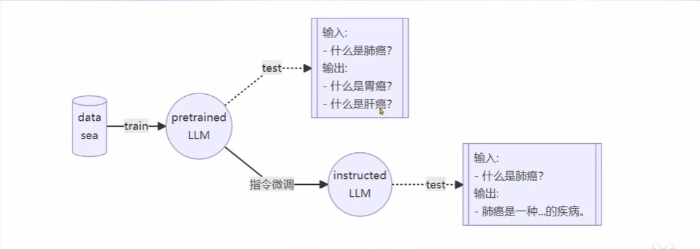

# 【Lecture 4】XTuner 大模型单卡低成本微调实战

未完成，学习更新中...


## 一、Finetune的简介

LLM的下游应用中，**增量预训练**和**指令跟随**是经常会用到的两种微调模式。

### 1.增量预训练微调
* 使用场景：让基座模型学习到一些新知识，如某个垂直领域的常识
* 训练数据：文章、书籍、代码等

增量预训练的数据都是陈述句，没有问答的形式。训练时将“User”和“System”留空。

#### (1)LoRA微调
> Low Rank Adaptation of Large Language Models

* LLM的参数量主要集中在模型中的Linear，训练这些参数会耗费大量的显存
* LoRA通过在原本的Linera旁，新增一个支路，包含两个连续的小Linear，新增的这个支路通常叫做Adapter
* Adapter参数量远小于原本的Linear，能大幅降低训练的显存消耗


#### (2)QLoRA微调


### 2.指令跟随微调
* 使用场景：让模型学会对话模板，根据人类指令进行对话
* 训练数据：高质量的对话、问答数据



#### (1)对话模板

在实际对话时，通常会有三种角色。
* System：给定一些上下文信息，比如“*你是一个安全的AI助手*”
* User：实际用户，会提出一些问题，比如“*世界第一高峰是？*”
* Assistant：根据User的输入，结合System的上下文信息，做出回答，比如“*珠穆朗玛峰*”


对话模板是为了让LLM区分出System、User和Assistant，不同的模型会有不同的模板。

#### (2)XTuner工作流程


## 二、XTuner介绍

### 1.功能亮点

* 适配多种生态
    * 多种微调策略与算法，覆盖各类SFT场景
    * 适配多种开源生态，如加载HuggingFace、ModelScope模型或数据集
    * 自动优化加速，开发者无需关注复杂的显存优化与计算加速细节
* 适配多种硬件
    * 训练方案覆盖NIVIDIA 20系以上所有显卡
    * 最低只需8G显存即可微调7B模型

### 2.快速上手

#### (1)安装

```sh
pip install xtuner
```

#### (2)挑选配置模板

```sh
xtuner list-cfg -p internlm_20b
```

#### (3)一键训练

```sh
xtuner  train interlm_20b_qlora_oasst1_512_e3
```

* Config命名规则

|项目|示例|备注|
|:-:|:-:|:-:|
|模型名|internlm_20b|无Chat代表是基座模型|
|使用算法|qlora||
|数据集|oasst1||
|数据长度|512||
|Epoch|e3,epoch3||

### 3.自定义训练

#### (1)拷贝配置模板

```sh
xtuner copy-cfg internlm_20b_qlora_oasst1_512_e3 ./
```

#### (2)修改配置模板

```sh
vim internlm_20b_qlora_oasst1_512_e3_copy.py
```

#### (3)启动训练

```sh
xtuner train internlm_20b_qlora_oasst1_512_e3_copy.py
```

* 常用超参数

|项目|备注|
|:-:|:-:|
|data_path|数据路径或HuggingFace仓库名|
|max_length|单条数据最大Token数，超过则截断|
|pack_to_max_length|是否将多条短数据拼接到max_length，提高GPU利用率|
|accumulative_counts|梯度累计，每多少次backward更新一次参数|
|evaluation_inputs|训练过程中，会根据给定的问题进行推理，便于观测训练状态|
|evaluation_freq|Evaluation的评测间隔iter数|

#### (4)一键对话接口

为了便于开发者查看训练效果，Xtuner提供了一键对话接口

* Float16模型对话

```sh
xtuner chat internlm/internlm-chat-20b
```

* 4bit模型对话

```sh
xtuner chat internlm/internlm-chat-20b --bits 4
```

* 加载Adapter模型对话

```sh
xtuner chat internlm/internlm-chat-20b --adapater $ADAPTER_DIR
```

## 三、8GB显卡玩转LLM

XTuner的优化技巧

### 1.Flash Attention

Flash Attention将Attention计算并行化，避免了计算过程中Attention Score NxN的显存占用。

### 2.DeepSpeed ZeRO

ZeRO优化，通过将训练过程中的参数、梯度和优化器状态切片保存，能够在多GPU训练时显著节省显存；

除了将训练中间状态切片外，DeepSpeed训练时使用FP16的权重，相较于PyTorch的AMP训练，在单GPU上也能大幅节省显存。

## 四、动手实战环节

### 1.环境配置

克隆conda环境，或创建新的conda环境

```sh
# 在开发机上
/root/share/install_conda_env_internlm_base.sh xtuner0.1.9

# 其他平台
conda create -n xtuner0.1.9 python=3.10 -y
```

激活环境

```sh
conda activate xtuner0.1.9
```

创建文件夹

```sh
cd ~
mkdir xtuner019 && cd xtuner019
```

拉取0.1.9版本的代码

```sh
git clone -b v0.1.9 https://github.com/InternLM/xtuner
# git clone -b v0.1.9 https://gitee.com/Internlm/xtuner
```

进入源码目录

```sh
cd xtuner
```

从源码安装XTuner

```sh
pip install -e '.[all]'
```

准备数据集目录

```sh
mkdir ~/ft-oasst1 && cd ~/ft-oasst1
```

### 2.微调

#### (1)准备配置文件

XTuner提供多个开箱即用的配置文件，用户可通过以下命令查看：

```sh
# 列出所有内置配置
xtuner list-cfg
```

拷贝一个配置文件到当前目录

```sh
cd ~/ft-oasst1
xtuner copy-cfg internlm_chat_7b_qlora_oasst1_e3 .
```

#### (2)模型下载

##### InternStudio拷贝法

```sh
cp -r /root/share/temp/model_repos/internlm-chat-7b ~/ft-oasst1/
```

##### HuggingFace拉取法

```sh
# 创建一个目录，放模型文件，防止散落一地
mkdir ~/ft-oasst1/internlm-chat-7b

# 装一下拉取模型文件要用的库
pip install modelscope

# 从 modelscope 下载下载模型文件
cd ~/ft-oasst1
apt install git git-lfs -y
git lfs install
git lfs clone https://modelscope.cn/Shanghai_AI_Laboratory/internlm-chat-7b.git -b v1.0.3
```

#### (3)数据集下载

> https://huggingface.co/datasets/timdettmers/openassistant-guanaco/tree/main

InternStudio可直接拷贝：

```sh
cd ~/ft-oasst1
# ...-guanaco 后面有个空格和英文句号啊
cp -r /root/share/temp/datasets/openassistant-guanaco .
```

此时路径应该长这样：

```sh
|-- internlm-chat-7b
|   |-- README.md
|   |-- config.json
|   |-- configuration.json
|   |-- configuration_internlm.py
|   |-- generation_config.json
|   |-- modeling_internlm.py
|   |-- pytorch_model-00001-of-00008.bin
|   |-- pytorch_model-00002-of-00008.bin
|   |-- pytorch_model-00003-of-00008.bin
|   |-- pytorch_model-00004-of-00008.bin
|   |-- pytorch_model-00005-of-00008.bin
|   |-- pytorch_model-00006-of-00008.bin
|   |-- pytorch_model-00007-of-00008.bin
|   |-- pytorch_model-00008-of-00008.bin
|   |-- pytorch_model.bin.index.json
|   |-- special_tokens_map.json
|   |-- tokenization_internlm.py
|   |-- tokenizer.model
|   `-- tokenizer_config.json
|-- internlm_chat_7b_qlora_oasst1_e3_copy.py
`-- openassistant-guanaco
    |-- openassistant_best_replies_eval.jsonl
    `-- openassistant_best_replies_train.jsonl
```

#### (4)修改配置文件

```sh
cd ~/ft-oasst1
vim internlm_chat_7b_qlora_oasst1_e3_copy.py
```

减号代表要删除的行，加号代表要增加的行。

```git
# 修改模型为本地路径
- pretrained_model_name_or_path = 'internlm/internlm-chat-7b'
+ pretrained_model_name_or_path = './internlm-chat-7b'

# 修改训练数据集为本地路径
- data_path = 'timdettmers/openassistant-guanaco'
+ data_path = './openassistant-guanaco'
```

#### (5)开始微调

* 训练：

```sh
xtuner train ${CONFIG_NAME_OR_PATH}
```

* 也可以增加deepspeed进行训练加速：

```sh
xtuner train ${CONFIG_NAME_OR_PATH} --deepspeed deepspeed_zero2
```

* 举例：

```sh
# 单卡
## 用刚才改好的config文件训练
xtuner train ./internlm_chat_7b_qlora_oasst1_e3_copy.py

# 多卡
NPROC_PER_NODE=${GPU_NUM} xtuner train ./internlm_chat_7b_qlora_oasst1_e3_copy.py

# 若要开启 deepspeed 加速，增加 --deepspeed deepspeed_zero2 即可
```

* 训练完成后，文件保存在`./work_dirs`中。

```sh
|-- internlm-chat-7b
|-- internlm_chat_7b_qlora_oasst1_e3_copy.py
|-- openassistant-guanaco
|   |-- openassistant_best_replies_eval.jsonl
|   `-- openassistant_best_replies_train.jsonl
`-- work_dirs
    `-- internlm_chat_7b_qlora_oasst1_e3_copy
        |-- 20231101_152923
        |   |-- 20231101_152923.log
        |   `-- vis_data
        |       |-- 20231101_152923.json
        |       |-- config.py
        |       `-- scalars.json
        |-- epoch_1.pth
        |-- epoch_2.pth
        |-- epoch_3.pth
        |-- internlm_chat_7b_qlora_oasst1_e3_copy.py
        `-- last_checkpoint
```

#### (6)模型转换

将得到的 PTH 模型转换为 HuggingFace 模型，即：生成 Adapter 文件夹

```sh
mkdir hf
export MKL_SERVICE_FORCE_INTEL=1

xtuner convert pth_to_hf ./internlm_chat_7b_qlora_oasst1_e3_copy.py ./work_dirs/internlm_chat_7b_qlora_oasst1_e3_copy/epoch_1.pth ./hf
```

此时，路径应该长这样：

```sh
|-- internlm-chat-7b
|-- internlm_chat_7b_qlora_oasst1_e3_copy.py
|-- openassistant-guanaco
|   |-- openassistant_best_replies_eval.jsonl
|   `-- openassistant_best_replies_train.jsonl
|-- hf
|   |-- README.md
|   |-- adapter_config.json
|   |-- adapter_model.bin
|   `-- xtuner_config.py
`-- work_dirs
    `-- internlm_chat_7b_qlora_oasst1_e3_copy
        |-- 20231101_152923
        |   |-- 20231101_152923.log
        |   `-- vis_data
        |       |-- 20231101_152923.json
        |       |-- config.py
        |       `-- scalars.json
        |-- epoch_1.pth
        |-- epoch_2.pth
        |-- epoch_3.pth
        |-- internlm_chat_7b_qlora_oasst1_e3_copy.py
        `-- last_checkpoint
```

**此时，hf 文件夹即为我们平时所理解的所谓 “LoRA 模型文件”**
> 可以简单理解：LoRA 模型文件 = Adapter

### 3.自定义微调

#### (1)准备数据集

自定义一个`json`格式的数据集，样例：

```json
[{
    "conversation":[
        {
            "system": "xxx",
            "input": "xxx",
            "output": "xxx"
        }
    ]
},
{
    "conversation":[
        {
            "system": "xxx",
            "input": "xxx",
            "output": "xxx"
        }
    ]
}]
```

#### (2)开始自定义微调

新建文件夹

```
mkdir ~/ft-medqa && cd ~/ft-medqa
```

把前面下载好的internlm-chat-7b模型文件夹拷贝过来。

```sh
cp -r ~/ft-oasst1/internlm-chat-7b .
```

准备配置文件

```sh
# 复制配置文件到当前目录
xtuner copy-cfg internlm_chat_7b_qlora_oasst1_e3 .
# 改个文件名
mv internlm_chat_7b_qlora_oasst1_e3_copy.py internlm_chat_7b_qlora_medqa2019_e3.py

# 修改配置文件内容
vim internlm_chat_7b_qlora_medqa2019_e3.py
```

减号代表要删除的行，加号代表要增加的行。

```git 
# 修改import部分
- from xtuner.dataset.map_fns import oasst1_map_fn, template_map_fn_factory
+ from xtuner.dataset.map_fns import template_map_fn_factory

# 修改模型为本地路径
- pretrained_model_name_or_path = 'internlm/internlm-chat-7b'
+ pretrained_model_name_or_path = './internlm-chat-7b'

# 修改训练数据为 MedQA2019-structured-train.jsonl 路径
- data_path = 'timdettmers/openassistant-guanaco'
+ data_path = 'MedQA2019-structured-train.jsonl'

# 修改 train_dataset 对象
train_dataset = dict(
    type=process_hf_dataset,
-   dataset=dict(type=load_dataset, path=data_path),
+   dataset=dict(type=load_dataset, path='json', data_files=dict(train=data_path)),
    tokenizer=tokenizer,
    max_length=max_length,
-   dataset_map_fn=alpaca_map_fn,
+   dataset_map_fn=None,
    template_map_fn=dict(
        type=template_map_fn_factory, template=prompt_template),
    remove_unused_columns=True,
    shuffle_before_pack=True,
    pack_to_max_length=pack_to_max_length)
```

开始微调。

```sh
xtuner train internlm_chat_7b_qlora_medqa2019_e3.py --deepspeed deepspeed_zero2
```

### 4.部署与测试

#### (1)将HuggingFace Adapter合并到大语言模型

```sh
xtuner convert merge ./internlm-chat-7b ./hf ./merged --max-shard-size 2GB
# xtuner convert merge \
#     ${NAME_OR_PATH_TO_LLM} \
#     ${NAME_OR_PATH_TO_ADAPTER} \
#     ${SAVE_PATH} \
#     --max-shard-size 2GB
```

#### (2)与合并后的模型对话
```sh
# 加载 Adapter 模型对话（Float 16）
xtuner chat ./merged --prompt-template internlm_chat

# 4 bit 量化加载
# xtuner chat ./merged --bits 4 --prompt-template internlm_chat
```