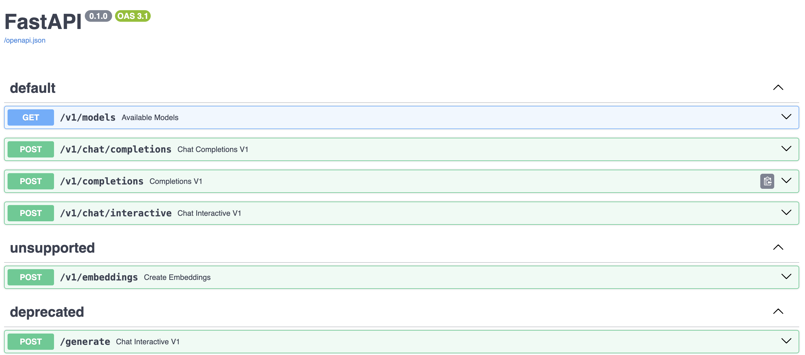

# 【Lecture 5】LMDeploy大模型量化部署实践

## 一、大模型部署背景

### 1.模型部署

#### (1)定义

* 将训练好的模型在特定软硬件环境中启动的过程，使模型能够接收输入并返回预测结果。
* 为了满足性能和效率的需求，常常需要对模型进行优化，例如模型压缩和硬件加速。

#### (2)产品形态

* 云端、边缘计算端、移动端

#### (3)计算设备

* CPU、GPU、NPU、TPU

### 2.大模型特点

#### (1)内存开销巨大

* 庞大的参数量。7B模型仅权重就需要14+G内存
* 采用自回归生成Token，需要缓存Attention的K/V，带来巨大的内存开销

#### (2)动态Shape

* 请求数不固定
* Token逐个生成，且数量不定

#### (3)相对视觉模型，LLM结构简单

* Transformers结构，大部分是decoder-only

### 3.大模型部署挑战

#### (1)设备

* 如何应对巨大的存储问题？低存储设备（消费级显卡、手机等）如何部署？

#### (2)推理

* 如何加速token的生成速度
* 如何解决动态shape，让推理可以不间断
* 如何有效管理和利用内存

#### (3)服务

* 如何提升系统整体吞吐量？
* 对于个体用户，如何降低反应时间？

### 4.大模型部署方案

#### (1)技术点

* 模型并行
* 低比特量化
* Page Attention
* Transformer计算和访存优化
* Continuous Batch
* ……

#### (2)方案

* Huggingface Transformers
* 专门的推理加速框架
* 云端
    * LMDeploy
    * vllm
    * tensorrt-llm
    * deepspeed
    * ...
* 移动端
    * llama.cpp
    * mlc-llm
    * ...

## 二、LMDeploy简介

LMDeploy是LLM在英伟达设备上部署的全流程解决方案，包括模型轻量化、推理和服务。


## 三、动手实践环节

### 1.环境配置

创建虚拟环境。
```
/root/share/install_conda_env_internlm_base.sh lmdeploy
```

激活虚拟环境。

```sh
conda activate lmdeploy
```

安装IMDeploy

```sh
pip install packaging
pip install /root/share/wheels/flash_attn-2.4.2+cu118torch2.0cxx11abiTRUE-cp310-cp310-linux_x86_64.whl
pip install 'lmdeploy[all]==v0.1.0'
```

### 2.服务部署

#### (1)模型转换

使用TurboMind推理模型需要先将模型转化为TurboMind格式，目前支持在线转换和离线转换两种形式。在线转换可以直接加载Huggingface模型，离线转换需要先保存模型再加载。

TurboMind 是一款关于 LLM 推理的高效推理引擎，基于英伟达的[FasterTransformer](https://github.com/NVIDIA/FasterTransformer)研发而成。它的主要功能包括：LLaMa 结构模型的支持，persistent batch 推理模式和可扩展的 KV 缓存管理器。

##### 在线转换

IMDeploy支持直接读取Huggingface模型权重，目前共支持三种类型：
* 在huggingface.co上面通过IMDeploy量化的模型，如[llama2-70b-4bit](https://huggingface.co/lmdeploy/llama2-chat-70b-4bit)，[internlm-chat-20b-4bit](https://huggingface.co/internlm/internlm-chat-20b-4bit)
* huggingface.co上面其他LM模型，如Qwen/Qwen-7B-Chat

示例：

```sh
# 需要能访问 Huggingface 的网络环境
lmdeploy chat turbomind internlm/internlm-chat-20b-4bit --model-name internlm-chat-20b
lmdeploy chat turbomind Qwen/Qwen-7B-Chat --model-name qwen-7b
```

上面两行命令分别展示了如何直接加载 Huggingface 的模型，第一条命令是加载使用 lmdeploy 量化的版本，第二条命令是加载其他 LLM 模型。

我们也可以直接启动本地的 Huggingface 模型，如下所示。

```sh
lmdeploy chat turbomind /share/temp/model_repos/internlm-chat-7b/  --model-name internlm-chat-7b
```

##### 离线转换

离线转换需要在启动服务之前，将模型转为 lmdeploy TurboMind 的格式，如下所示。

```sh
# 转换模型（FastTransformer格式） TurboMind
lmdeploy convert internlm-chat-7b /path/to/internlm-chat-7b
```

执行完成后将会在当前目录生成一个`workspace`的文件夹。这里面包含的就是`TurboMind`和`Triton`“模型推理”需要到的文件。


`weights`和`tokenizer`目录分别放的是拆分后的参数和`Tokenizer`。如果我们进一步查看`weights`的目录，就会发现参数是按层和模块拆开的，如下图所示。


每一份参数第一个`0`表示“层”的索引，后面的那个0表示`Tensor`并行的索引，因为我们只有一张卡，所以被拆分成`1`份。如果有两张卡可以用来推理，则会生成0和1两份，也就是说，会把同一个参数拆成两份。比如`layers.0.attention.w_qkv.0.weight`会变成`layers.0.attention.w_qkv.0.weight`和`layers.0.attention.w_qkv.1.weight`。执行`lmdeploy convert`命令时，可以通过`--tp`指定（tp 表示 tensor parallel），该参数默认值为1（也就是一张卡）。

##### 关于Tensor并行

Tensor并行一般分为行并行或列并行。简单来说，就是把一个大的张量（参数）分到多张卡上，分别计算各部分的结果，然后再同步汇总。

* 列并行：


* 行并行：


#### (2)TurboMind推理+命令行本地对话

执行命令如下：

```sh
# Turbomind + Bash Local Chat
lmdeploy chat turbomind ./workspace
```

#### (3)TurboMind推理+API服务

在上面的部分我们尝试了直接用命令行启动 Client，接下来我们尝试如何运用 lmdepoy 进行服务化。

首先，通过下面命令启动服务。

```sh
# ApiServer+Turbomind   api_server => AsyncEngine => TurboMind
lmdeploy serve api_server ./workspace \
	--server_name 0.0.0.0 \
	--server_port 23333 \
	--instance_num 64 \
	--tp 1
```

上面的参数中`server_name`和`server_port`分别表示服务地址和端口，`tp`参数我们之前已经提到过了，表示Tensor并行。还剩下一个`instance_num`参数，表示实例数，可以理解成`Batch`的大小。

然后，我们可以新开一个窗口，执行下面的 Client 命令。如果使用官方机器，可以打开 vscode 的 Terminal，执行下面的命令。

```sh
# ChatApiClient+ApiServer（注意是http协议，需要加http）
lmdeploy serve api_client http://localhost:23333
```

当然，刚刚我们启动的是`API Server`，自然也有相应的接口。可以直接打开`http://{host}:23333`查看，如下图所示。



#### (4)网页Demo演示

##### TurboMind服务作为后端

```sh
# Gradio+ApiServer。必须先开启 Server，此时 Gradio 为 Client
lmdeploy serve gradio http://0.0.0.0:23333 \
	--server_name 0.0.0.0 \
	--server_port 6006 \
	--restful_api True
```

##### TurboMind 推理作为后端

Gradio 也可以直接和 TurboMind 连接。

```sh
# Gradio+Turbomind(local)
lmdeploy serve gradio ./workspace
```

可以直接启动 Gradio，此时没有 API Server，TurboMind 直接与 Gradio 通信。

##### TurboMind 推理 + Python 代码集成

```py
from lmdeploy import turbomind as tm

# load model
model_path = "/root/InternLM-History/internlm-chat-7b"
tm_model = tm.TurboMind.from_pretrained(model_path, model_name='internlm-chat-7b')
generator = tm_model.create_instance()

# process query
query = "你好啊兄嘚"
prompt = tm_model.model.get_prompt(query)
input_ids = tm_model.tokenizer.encode(prompt)

# inference
for outputs in generator.stream_infer(
        session_id=0,
        input_ids=[input_ids]):
    res, tokens = outputs[0]

response = tm_model.tokenizer.decode(res.tolist())
print(response)
```

#### (5)模型配置实践

在离线转换一节，我们查看了`weights`的目录，里面存放的是模型按层、按并行卡拆分的参数，不过还有一个文件`config.ini`并不是模型参数，它里面存的主要是模型相关的配置信息。下面是一个示例。

```ini
[llama]
model_name = internlm-chat-7b
tensor_para_size = 1
head_num = 32
kv_head_num = 32
vocab_size = 103168
num_layer = 32
inter_size = 11008
norm_eps = 1e-06
attn_bias = 0
start_id = 1
end_id = 2
session_len = 2056
weight_type = fp16
rotary_embedding = 128
rope_theta = 10000.0
size_per_head = 128
group_size = 0
max_batch_size = 64
max_context_token_num = 1
step_length = 1
cache_max_entry_count = 0.5
cache_block_seq_len = 128
cache_chunk_size = 1
use_context_fmha = 1
quant_policy = 0
max_position_embeddings = 2048
rope_scaling_factor = 0.0
use_logn_attn = 0
```

其中，模型属性相关的参数不可更改，主要包括下面这些。

```ini
model_name = llama2
head_num = 32
kv_head_num = 32
vocab_size = 103168
num_layer = 32
inter_size = 11008
norm_eps = 1e-06
attn_bias = 0
start_id = 1
end_id = 2
rotary_embedding = 128
rope_theta = 10000.0
size_per_head = 128
```

和数据类型相关的参数也不可更改，主要包括两个。

```ini
weight_type = fp16
group_size = 0
```

`weight_type`表示权重的数据类型。目前支持`fp16`和`int4`。`int4`表示`4bit`权重。当 `weight_type`为`4bit`权重时，`group_size`表示`awq`量化权重时使用的`group`大小。

剩余参数包括下面几个。

```ini
tensor_para_size = 1
session_len = 2056
max_batch_size = 64
max_context_token_num = 1
step_length = 1
cache_max_entry_count = 0.5
cache_block_seq_len = 128
cache_chunk_size = 1
use_context_fmha = 1
quant_policy = 0
max_position_embeddings = 2048
rope_scaling_factor = 0.0
use_logn_attn = 0
```

一般情况下，我们并不需要对这些参数进行修改，但有时候为了满足特定需要，可能需要调整其中一部分配置值。这里主要介绍三个可能需要调整的参数。

* KV int8 开关：
    * 对应参数为`quant_policy`，默认值为 0，表示不使用`KV Cache`，如果需要开启，则将该参数设置为 4。
    * `KV Cache`是对序列生成过程中的`K`和`V`进行量化，用以节省显存。我们下一部分会介绍具体的量化过程。
    * 当显存不足，或序列比较长时，建议打开此开关。
* 外推能力开关：
    * 对应参数为`rope_scaling_factor`，默认值为`0.0`，表示不具备外推能力，设置为`1.0`，可以开启`RoPE`的`Dynamic NTK`功能，支持长文本推理。另外，`use_logn_attn`参数表示`Attention`缩放，默认值为`0`，如果要开启，可以将其改为`1`。
    * 外推能力是指推理时上下文的长度超过训练时的最大长度时模型生成的能力。如果没有外推能力，当推理时上下文长度超过训练时的最大长度，效果会急剧下降。相反，则下降不那么明显，当然如果超出太多，效果也会下降的厉害。
    * 当推理文本非常长（明显超过了训练时的最大长度）时，建议开启外推能力。
* 批处理大小：
    * 对应参数为`max_batch_size`，默认为`64`，也就是我们在`API Server`启动时的 `instance_num`参数。
    * 该参数值越大，吞度量越大（同时接受的请求数），但也会占用更多显存。
    * 建议根据请求量和最大的上下文长度，按实际情况调整。

### 3.模型量化

本部分内容主要介绍如何对模型进行量化。主要包括`KV Cache`量化和模型参数量化。总的来说，量化是一种以参数或计算中间结果精度下降换空间节省（以及同时带来的性能提升）的策略。

正式介绍`LMDeploy`量化方案前，需要先介绍两个概念：

* 计算密集（compute-bound）: 指推理过程中，绝大部分时间消耗在数值计算上；针对计算密集型场景，可以通过使用更快的硬件计算单元来提升计算速。
* 访存密集（memory-bound）: 指推理过程中，绝大部分时间消耗在数据读取上；针对访存密集型场景，一般通过减少访存次数、提高计算访存比或降低访存量来优化。

常见的`LLM`模型由于`Decoder Only`架构的特性，实际推理时大多数的时间都消耗在了逐`Token`生成阶段（Decoding 阶段），是典型的访存密集型场景。

那么，如何优化LLM模型推理中的访存密集问题呢？ 我们可以使用`KV Cache`量化和`4bit Weight Only`量化（W4A16）。`KV Cache`量化是指将逐`Token`（Decoding）生成过程中的上下文`K`和`V`中间结果进行`INT8`量化（计算时再反量化），以降低生成过程中的显存占用。`4bit Weight`量化，将`FP16`的模型权重量化为`INT4`，`Kernel`计算时，访存量直接降为`FP16`模型的`1/4`，大幅降低了访存成本。`Weight Only`是指仅量化权重，数值计算依然采用`FP16`（需要将`INT4`权重反量化）。

#### (1)KV Cache量化

`KV Cache`量化是将已经生成序列的`KV`变成`Int8`，使用过程一共包括三步：

第一步：计算`minmax`。主要思路是通过计算给定输入样本在每一层不同位置处计算结果的统计情况。

* 对于`Attention`的`K`和`V`：取每个`Head`各自维度在所有Token的最大、最小和绝对值最大值。对每一层来说，上面三组值都是`(num_heads, head_dim) `的矩阵。这里的统计结果将用于本小节的`KV Cache`。

* 对于模型每层的输入：取对应维度的最大、最小、均值、绝对值最大和绝对值均值。每一层每个位置的输入都有对应的统计值，它们大多是 `(hidden_dim, ) `的一维向量，当然在`FFN`层由于结构是先变宽后恢复，因此恢复的位置维度并不相同。这里的统计结果用于下个小节的模型参数量化，主要用在缩放环节。

第一步执行命令如下：

```sh
# 计算 minmax
lmdeploy lite calibrate \
  --model  /root/InternLM-History/internlm-chat-7b \
  --calib_dataset "c4" \
  --calib_samples 128 \
  --calib_seqlen 2048 \
  --work_dir ./quant_output
```

在这个命令行中，会选择 128 条输入样本，每条样本长度为 2048，数据集选择 C4，输入模型后就会得到上面的各种统计值。值得说明的是，如果显存不足，可以适当调小 samples 的数量或 sample 的长度。

> 这一步由于默认需要从 Huggingface 下载数据集，国内经常不成功。所以我们导出了需要的数据，大家需要对读取数据集的代码文件做一下替换。共包括两步：\
> * 第一步：复制 calib_dataloader.py 到安装目录替换该文件：cp /root/share/temp/datasets/c4/calib_dataloader.py  /root/.conda/envs/lmdeploy/lib/python3.10/site-packages/lmdeploy/lite/utils/ \
> * 第二步：将用到的数据集（c4）复制到下面的目录：cp -r /root/share/temp/datasets/c4/ /root/.cache/huggingface/datasets/

第二步：通过 minmax 获取量化参数。主要就是利用下面这个公式，获取每一层的 K V 中心值（zp）和缩放值（scale）。

```sh
zp = (min+max) / 2
scale = (max-min) / 255
quant: q = round( (f-zp) / scale)
dequant: f = q * scale + zp
```

有这两个值就可以进行量化和解量化操作了。具体来说，就是对历史的 K 和 V 存储 quant 后的值，使用时在 dequant。

第二步的执行命令如下：

```sh
# 通过 minmax 获取量化参数
lmdeploy lite kv_qparams \
  --work_dir ./quant_output  \
  --turbomind_dir workspace/triton_models/weights/ \
  --kv_sym False \
  --num_tp 1
```

在这个命令中，`num_tp`的含义前面介绍过，表示`Tensor`的并行数。每一层的中心值和缩放值会存储到`workspace`的参数目录中以便后续使用。`kv_sym`为`True`时会使用另一种（对称）量化方法，它用到了第一步存储的绝对值最大值，而不是最大值和最小值。

第三步：修改配置。也就是修改`weights/config.ini`文件，即上一章提到的`KV int8`开关，只需要把`quant_policy`改为`4`即可。

这一步需要额外说明的是，如果用的是`TurboMind1.0`，还需要修改参数`use_context_fmha`，将其改为`0`。

接下来就可以正常运行前面的各种服务了，只不过咱们现在可是用上了`KV Cache`量化，能更省（运行时）显存了。

#### (2)W4A16量化

W4A16中的A是指Activation，保持FP16，只对参数进行 4bit 量化。使用过程也可以看作是三步。

第二步：量化权重模型。利用第一步得到的统计值对参数进行量化，具体又包括两小步：

* 缩放参数。主要是性能上的考虑（回顾 PPT）。
* 整体量化。

第二步的执行命令如下：

```sh
# 量化权重模型
lmdeploy lite auto_awq \
  --model  /root/InternLM-History/internlm-chat-7b/ \
  --w_bits 4 \
  --w_group_size 128 \
  --work_dir ./quant_output 
```

命令中`w_bits`表示量化的位数，`w_group_size`表示量化分组统计的尺寸，`work_dir`是量化后模型输出的位置。这里需要特别说明的是，因为没有`torch.int4`，所以实际存储时，8个`4bit`权重会被打包到一个`int32`值中。所以，如果你把这部分量化后的参数加载进来就会发现它们是`int32`类型的。

最后一步：转换成`TurboMind`格式。

```sh
# 转换模型的layout，存放在默认路径 ./workspace 下
lmdeploy convert  internlm-chat-7b ./quant_output \
    --model-format awq \
    --group-size 128 \
    --dst_path ./workspace_quant
```

#### (3)最佳实践

* Step1：优先尝试正常（非量化）版本，评估效果。
    * 如果效果不行，需要尝试更大参数模型或者微调。
    * 如果效果可以，跳到下一步。
* Step2：尝试正常版本+KV Cache 量化，评估效果。
    * 如果效果不行，回到上一步。
    * 如果效果可以，跳到下一步。
* Step3：尝试量化版本，评估效果。
    * 如果效果不行，回到上一步。
    * 如果效果可以，跳到下一步。
* Step4：尝试量化版本+ KV Cache 量化，评估效果。
    * 如果效果不行，回到上一步。
    * 如果效果可以，使用方案。